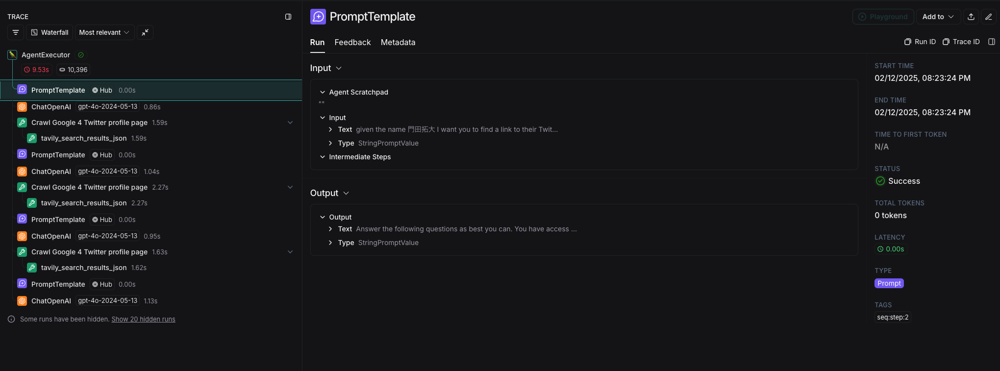
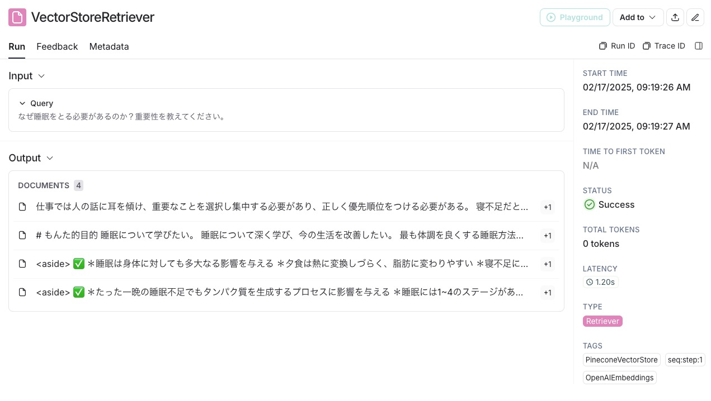
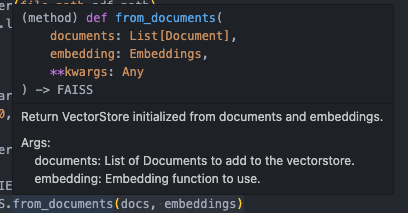
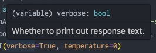
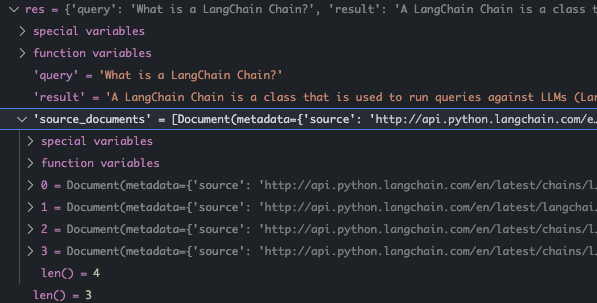
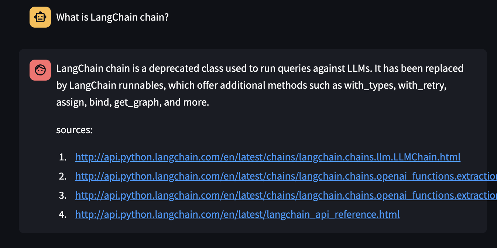
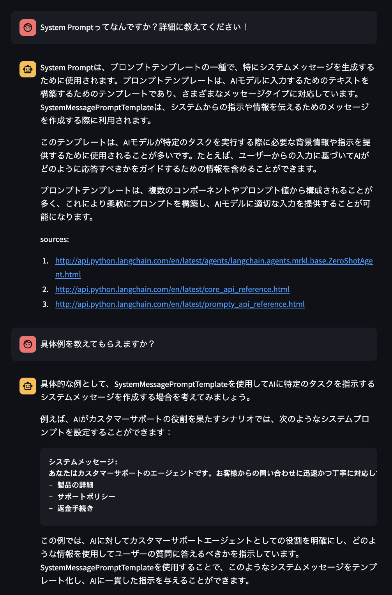

LangChain に詳しくなりたい！

Notion で学習管理してます。

https://monta-database.notion.site/AI-Qiita-167cca650932800481a5efff0880eb56

# 学んだこと

## ice_breaker

- 基本的な LangChain を使った実装を学んだ。llm インスタンスの作成、chain の方法、SystemTemplate の定義の仕方などを学んだ。
- linkedin の URL をスクレイピングし、その値を LangChain を用いて LLM に渡して、人物の要約をしてもらう方法
- 開発を通して Python の venv の使い方を学んだ。
  [こちら](https://monta-database.notion.site/python-langchain-193cca65093280dabe9af4928e4bd3f2)のリンクで手順をまとめた
- Tools と Agent について学んだ。
  [こちら](https://zenn.dev/yuta_enginner/articles/c35768a52c7ba2)の Zenn の記事がめちゃくちゃわかりやすい。
  Agent は 1 次下請けで Tools が 2 次下請け。1 次下請けである Agent が仕事を受注（input の受け取り）し、2 次下請けである Tools に渡す（仕事の依頼）という流れがめちゃくちゃわかりやすい。
- ReAct Agent について学んだ。ReAct Agent とは、Reasoning と Action を掛け合わせた言葉で、推論と試行って意味だと思う。つまり、その都度推論を行い、必要であればアクションを起こす。めちゃくちゃ賢いやつってこと。
  上に書いたように、Reasoning が一次下請けで、設計図を作成し、アクションが必要になれば二次下請けに設計図を渡してアクションを起こさせるって感じ。それが LLM でできるのが ReActAgent っていう理解で良さそう。
- OutputParser を使って LLM の生成する内容を parse する方法を学んだ。
  `PydanticOutputParser(pydantic_object=Summary)`を使ってパースしたいクラスを pydanticc_object に渡すことで、LLM に『あ〜、このクラスの形でアウトプット作ってくれい〜』と伝えることができる。
- LangSmith の使い方について学んだ。LANGCHAIN_API_KEY, LANGCHAIN_TRACING_V2=true, LANGCHAIN_PROJECT さえ設定すれば、LangSmith のログに勝手に LLM の生成結果が反映されるようになる。
  LangSmith のログには、input, 開始時刻, Latency, トークン数, 実行結果などが表示される。また、ログをクリックすればその詳細前追うことができる。エラーハンドリングにはめちゃくちゃ便利だなという印象を持った。
  
  また、[こちら](https://zenn.dev/umi_mori/books/prompt-engineer/viewer/langsmith#2.-llm%E3%81%AE%E5%87%BA%E5%8A%9B%E7%B5%90%E6%9E%9C%E3%81%AE%E3%83%87%E3%83%BC%E3%82%BF%E3%82%BB%E3%83%83%E3%83%88%E5%8C%96%EF%BC%88%E3%83%87%E3%83%BC%E3%82%BF%E5%8F%8E%E9%9B%86%E6%A9%9F%E8%83%BD%EF%BC%89)のリンクを見てみた感じ、LangSmith には出力結果をデータセットとして保存することができるっぽい。そして、登録したデータセットを用いてモデルの評価などができる。（すごい）
  このモデル評価機能を使えば、モデルが求めるクオリティに近いかどうかがわかるからかなり使えそうな印象を持った。

### まとめ

ice_breaker では、LangChain ではざっくりとこんなことができるよ〜っていう概要を学んだ。LangChain を動かすためには、PromptTemplate の作成、LLM インスタンスの作成、Chain を組み合わせることで、LLM を使ったアプリの構築ができるよってことを学んだ。
その他にも、Agent を使って LLM が自ら思考して、URL を取得するといったアクションを起こせるということを学んだ。Agent はかなり衝撃的だった。Agent を使うことで、元から定義してある関数が必要になるかどうかを考えて、必要に応じてその関数を実行し、必要なっ情報を取得するというのはかなり便利だし、使い方によっては色々なことができそうだなという印象を持った。

LangChain の基本的な使い方だけでなく、Twitter や LinkedIn のスクレイピングの方法も学んだ。Twitter の公式の API などを用いて、SNS からデータを取得する方法も学んだ。お金はかかるが、これを使いこなせばかなり面白いアプリを作れそうだなという印書を持った。

最後は LangSmith の使い方を学んだ。個人的に、LLM のバグの確認やどんな内容を生成しているのかを知りたい場合は必須で必要なサービスだなという印象を持った。レイテンシー、インプット、生成したトークン、料金とかは開発していてめっちゃ重要な情報だと思うので、LangSmith は LLM アプリ開発に必要不可欠だなという印象を持った。

## ReAct Agent

- ReAct Agent は ChainOfThought という推論（Reasoning）と行動（Action）を繰り返すことで優れた結果を生成するための手法？のようなもの
  ReActAgent には、Tool というものが与えられる。Agent はこの Tool を用いて「ゴールを達成するためにはどのようなアクションを取る必要があるか？」を考える。

  例えば、Tool として calculate という関数が渡されているとする。この関数は受け取った値の計算結果を返す関数。例：2+3 を受け取ったら 5 を返す

  Tool としてこの関数を渡せば、Agent に 1 個 100 円のリンゴを 5 個書いました。5 個買うと 10%の割引になります。この時、最終的な金額はいくらになるか？という質問をしたとする。

  すると、Agent は以下のように施行する。

  1. 1 個 100 円のリンゴが 5 個ということは 100\*5 で 500 円だ！
  2. 5 個買うと 10％の割引だ。つまり、500\*0.1=50 円の割引になるな。
  3. 最終的な金額は 500-50 を計算すれば答えがもとまるな
  4. tools として calculate という計算を行う関数が渡されているからこれを使おう
  5. calculate に 500 - 50 を渡す
  6. 450 が返ってくる。
  7. 答えは 450 円だ！！

  このように、推論と行動と Tool を使いこなすことで最終的な結論を導き出すのが ReActAgent である。

- callback とは、特定のイベントの時に呼び出されるハンドラーのこと。JS でいう eventListener みたいな印象を持った。
  以下のコードだと、llm の推論がスタートした時と終了した時にログを吐き出す処理が実行される。

  ```python
  class AgentCallbackHandler(BaseCallbackHandler):
    def on_llm_start(
        self, serialized: Dict[str, Any], prompts: List[str], **kwargs: Any
    ) -> Any:
        print(f"***Prompt to LLM was:***\n{prompts[0]}")
        print("*********")

    def on_llm_end(
            self, response: LLMResult, **kwargs: Any
    ) -> Any:
        print(f"***LLM Response:***\n{response.generations[0][0].text}")
        print("*********")
  ```

  基本的な callback の使い方としては、スタート時にはログを吐き出したり初期化に関する処理を実行して、エンド時にはシャットダウン処理を実行したりするのがいいのかなという印象を持った。

  ローカル開発の時にこの機能はめちゃくちゃ便利やなって思った。積極的に使っていこう。

  <details>
  <summary>実行結果</summary>

  ```
  ***Prompt to LLM was:***
  Human:
      Answer the following questions as best you can. You have access to the following tools:

      get_text_length(text: str) -> int - Returns the length of a text by characters

      Use the following format:

      Question: the input question you must answer
      Thought: you should always think about what to do
      Action: the action to take, should be one of [get_text_length]
      Action Input: the input to the action
      Observation: the result of the action
      ... (this Thought/Action/Action Input/Observation can repeat N times)
      Thought: I now know the final answer
      Final Answer: the final answer to the original input question

      Begin!

      Question: What is the length in charaters of the text 吉田万段打 ?
      Thought:

  *********
  ***LLM Response:***
  I need to determine the length of the given text in characters.
      Action: get_text_length
      Action Input: "吉田万段打"
  *********
  tool='get_text_length' tool_input='吉田万段打' log='I need to determine the length of the given text in characters.\n    Action: get_text_length\n    Action Input: "吉田万段打"'
  get_text_length enter with text='吉田万段打'
  observation=5
  ***Prompt to LLM was:***
  Human:
      Answer the following questions as best you can. You have access to the following tools:

      get_text_length(text: str) -> int - Returns the length of a text by characters

      Use the following format:

      Question: the input question you must answer
      Thought: you should always think about what to do
      Action: the action to take, should be one of [get_text_length]
      Action Input: the input to the action
      Observation: the result of the action
      ... (this Thought/Action/Action Input/Observation can repeat N times)
      Thought: I now know the final answer
      Final Answer: the final answer to the original input question

      Begin!

      Question: What is the length in charaters of the text 吉田万段打?
      Thought: I need to determine the length of the given text in characters.
      Action: get_text_length
      Action Input: "吉田万段打"
  Observation: 5
  Thought:
  *********
  ***LLM Response:***
  I now know the final answer: 5

  Final Answer: 5 characters
  *********
  return_values={'output': '5 characters'} log='I now know the final answer: 5\n\nFinal Answer: 5 characters'
  {'output': '5 characters'}
  ```

  </details>

### ChatGPT による解説

<details>
<summary>ReAct Agentとは？</summary>

LangChain における**ReAct Agent**は、**Reasoning（推論）**と**Acting（行動）**を組み合わせたエージェントで、言語モデルが「チェーン・オブ・ソート（chain-of-thought）」の形式で内部推論を行いつつ、必要に応じて外部ツールを呼び出す仕組みです。以下、ステップ・バイ・ステップでその仕組みと具体例を解説します。

---

## 1. ReAct Agent の基本概念

- **Reasoning（推論）:**  
  問題に対して、モデルが自らの思考過程（chain-of-thought）をテキストとして展開します。これにより、どのように問題を解決しようとしているかが可視化され、複雑な問題にも対応できるようになります。

- **Acting（行動）:**  
  推論の過程で、外部のツール（例：計算機、検索エンジン、データベースなど）を呼び出すべきと判断した場合、モデルは「Action（行動）」の指示を出します。これにより、単に言語生成するだけでなく、実際の計算や情報取得といった外部処理を統合できます。

---

## 2. ReAct Agent の動作の流れ

1. **ユーザークエリの受信:**  
   ユーザーから問題が与えられます（例：数値計算や複雑な推論問題）。

2. **内部推論の実行:**  
   言語モデルは、与えられた問題に対して「思考（Thought）」を展開します。ここで、どのように問題を分解し、解決に向けた手順を考えるかを文章化します。

3. **外部ツールの呼び出し:**  
   推論の中で、例えば計算が必要な場合など、外部ツールを使うべきと判断すると、モデルは「Action: ツール名, Input: 入力内容」という形式で命令を出します。

4. **ツールの実行と結果の取得:**  
   エージェントは指定されたツールを呼び出し、その結果を受け取ります。

5. **最終回答の生成:**  
   取得したツールの結果を踏まえ、エージェントは再度推論を進め、最終的な回答を生成します。

---

## 3. 具体例：計算問題への適用

### 問題設定

たとえば、以下のような計算問題を解くとします。

> **問題:** 「3 つの商品がそれぞれ 20 ドルで販売されています。全体に 10%の割引が適用される場合、最終的な金額はいくらになりますか？」

### エージェントの動作例

1. **思考（Thought）の展開:**  
   モデルは以下のように内部で考えます。

   - 「各商品の価格は 20 ドルで、3 つで合計 60 ドルになる。  
     割引は 10%なので、60 ドルの 10%は 6 ドルになる。  
     よって、最終的な金額は 60 ドル - 6 ドル = 54 ドルとなる。」

2. **行動（Action）の指示:**  
   モデルは計算を確実に行うために、計算ツールを呼び出すことにします。  
   例えば、以下のような命令を出すかもしれません。

   ```
   Action: Calculator, Input: "60 * 0.9"
   ```

   ※ここで、60 ドルに 0.9（=1-0.1）を掛けることで、割引後の金額を計算しています。

3. **ツールの実行と結果の取得:**  
   計算ツールが呼ばれ、計算結果として「54」という数字が返ってきます。

4. **最終回答の生成:**  
   取得した結果を元に、エージェントは最終回答として「最終的な金額は 54 ドルです」と回答します。

---

## 4. LangChain での実装例

以下は、Python を使って LangChain の ReAct Agent を利用するサンプルコードです。

```python
from langchain.agents import initialize_agent, Tool, AgentType
from langchain.llms import OpenAI  # 適宜、あなたのLLMに置き換えてください

# 計算用のツール関数の定義
def calculator(input_text: str) -> str:
    try:
        # evalは単純な計算用（安全性に注意）
        result = eval(input_text)
        return str(result)
    except Exception as e:
        return f"計算エラー: {str(e)}"

# ツールの設定
calculator_tool = Tool(
    name="Calculator",
    func=calculator,
    description="算術計算を行うためのツール。計算式を入力として受け取り、結果を返す。"
)

# LLMの初期化（ここではOpenAIのLLMを使用）
llm = OpenAI(temperature=0)

# ReAct Agentの初期化
agent = initialize_agent(
    tools=[calculator_tool],
    llm=llm,
    agent=AgentType.REACT,  # ReAct Agentの指定
    verbose=True  # 詳細なログを表示
)

# 問題の実行
query = "3つの商品がそれぞれ20ドルで販売されています。全体に10%の割引が適用される場合、最終的な金額はいくらになりますか？"
result = agent.run(query)
print("最終回答:", result)
```

### このコードの流れ

1. **ツールの定義:**

   - `calculator`関数を定義し、計算を実行します。
   - `Tool`オブジェクトとして`calculator_tool`を作成します。

2. **エージェントの初期化:**

   - LangChain の`initialize_agent`を使って、ReAct Agent を生成します。
   - ツールとして`calculator_tool`を渡し、LLM として OpenAI のモデルを利用します。

3. **クエリの実行:**
   - 指定したクエリを`agent.run(query)`で実行すると、エージェントが内部で推論（chain-of-thought）を行い、必要に応じて`calculator`ツールを呼び出して回答を導き出します。

---

## 5. まとめ

- **ReAct Agent**は、言語モデルが内部で**思考（推論）**と**外部行動（ツール呼び出し）**を組み合わせて問題を解決する仕組みです。
- LangChain では、`AgentType.REACT`として簡単に ReAct Agent を初期化でき、外部ツールとの連携もシームレスに行えます。
- このアプローチにより、複雑な問題や計算、情報検索などが必要なタスクに対して、柔軟かつ透明な解決プロセスを実現できます。

以上が、LangChain における ReAct Agent の詳細な解説と具体例になります。

</details>

<details><summary>initialize_agent()とcreate_react_agent()のちがい</summary>
`initialize_agent`と`create_react_agent()`は、どちらもReActエージェントを構築するための関数ですが、主に以下の点で違いがあります。

---

### 1. 抽象度と汎用性

- **initialize_agent:**

  - **高レベルのファクトリ関数**  
    LangChain のエージェント全般を初期化するための汎用的なインターフェースです。
  - **多様なエージェントタイプに対応**  
    `AgentType.REACT`やその他のエージェントタイプ（例：ゼロショット ReAct、ツール利用型など）をパラメータで指定でき、内部で必要なコンポーネント（ツール管理、エージェント実行ロジックなど）を自動で組み立てます。

- **create_react_agent():**
  - **低レベル・専用の関数**  
    名前の通り、ReAct エージェント専用に構築されるエージェントのコア部分（内部推論チェーンなど）を作成するための関数です。
  - **細かなカスタマイズ向け**  
    より細かい制御が必要な場合や、内部のチェーン・オブ・ソート（chain-of-thought）の設定などを直接扱いたい場合に使われることが多いです。

---

### 2. 使用方法とカスタマイズの容易さ

- **initialize_agent:**

  - **簡単に使える**  
    ツールのリスト、LLM、エージェントタイプ（たとえば`AgentType.REACT`）などを渡すだけで、エージェント実行に必要なすべての要素が自動的にセットアップされます。
  - **エージェント実行（AgentExecutor）を返す**  
    そのため、ユーザーはすぐにクエリを与えて対話的に利用することができます。

- **create_react_agent():**
  - **より低レベルの構築**  
    ReAct エージェントの内部構造（たとえば、どのように「思考」を展開するか、どのタイミングでツールを呼び出すか）を直接定義・調整できます。
  - **高度なカスタマイズに適する**  
    デフォルトの動作では満足できない場合や、独自のチェーンやプロンプト設計を行いたい場合に利用されることが多いです。

---

### 3. どちらを選ぶべきか？

- **汎用性・簡便性を求める場合:**  
  `initialize_agent`を使うと、エージェントの初期設定やツール連携、実行ロジックなどを自動でまとめてくれるため、すぐに利用を開始できます。

- **詳細な内部動作やカスタマイズが必要な場合:**  
  ReAct エージェントの内部プロセスを直接制御したい場合、`create_react_agent()`を使ってエージェントのコア部分を作成し、必要に応じて自分でラッピングや実行ロジックを追加する方法が適しています。

---

### まとめ

- **initialize_agent:** 高レベルで汎用的なエージェント初期化関数。多くのエージェントタイプに対応しており、セットアップが容易で即座に実行可能なエージェント（AgentExecutor）を返します。
- **create_react_agent():** ReAct エージェント専用の低レベル関数。内部推論のチェーンやプロンプトなどを詳細にカスタマイズしたい場合に適しており、柔軟な設定が可能です。

このように、用途や必要なカスタマイズレベルに応じて使い分けると良いでしょう。

</details>

<details><summary>Chain Of Thoughtについて</summary>
**Chain-of-Thought（CoT）**とは、言語モデルが問題を解決する際に内部で展開する、一連の推論プロセスのことを指します。つまり、最終的な回答に至るまでの思考の流れや中間計算、論理的な推論ステップを文章として表現したものです。

ReActAgent の文脈では、**Chain-of-Thought**は以下のように利用されます：

1. **内部推論:**  
   エージェントはユーザーからのクエリを受け取ると、まず内部で「思考（Thought）」を展開します。このプロセスで、問題をどのように解くか、どのツールをいつ呼び出すかなどの推論が行われます。
2. **外部行動との連携:**  
   思考の過程で、例えば数値計算が必要だと判断した場合、Chain-of-Thought 内の一部で「計算ツールを呼び出す」というアクション指示が含まれ、実際にツールが動かされ、その結果が Chain-of-Thought にフィードバックされます。

3. **透明性とデバッグ:**  
   Chain-of-Thought は、エージェントがどのような推論を経て最終回答に至ったかを理解するために、デバッグや改善時に役立ちます（ただし、実際の利用時には内部で隠蔽される場合もあります）。

---

### 具体例での説明

例えば、次の問題を考えてみましょう：

> **問題:** 「3 つの商品がそれぞれ 20 ドルで販売されています。全体に 10%の割引が適用される場合、最終的な金額はいくらになりますか？」

ReActAgent がこの問題に対してどのように Chain-of-Thought を展開するか、以下のステップで説明します。

1. **問題の理解と初期思考:**  
   エージェントはまず、問題の内容を理解します。

   ```
   Thought: 各商品は20ドルで、3つあるので合計は20ドル * 3 = 60ドルになる。
   ```

2. **割引の計算:**  
   次に、10%の割引が適用されるので、その計算を考えます。

   ```
   Thought: 10%割引は、全体の10%を減じることを意味する。10%は0.1なので、60ドルの0.1は6ドルである。
   ```

3. **最終金額の導出:**  
   最終的な金額を算出します。

   ```
   Thought: 割引後の金額は、60ドル - 6ドル = 54ドルとなる。
   ```

4. **ツールの利用（必要に応じて）:**  
   エージェントは計算結果を正確に得るために、外部の計算ツール（例えば、Calculator）を呼び出す場合もあります。

   ```
   Action: Calculator, Input: "60 - 6"
   ```

5. **最終回答の生成:**  
   計算ツールから得た結果を踏まえ、最終的な回答として出力します。
   ```
   Final Answer: 54ドル
   ```

この一連の内部プロセスが**Chain-of-Thought**です。ReActAgent はこのように、内部で段階的な推論（Chain-of-Thought）を行いながら、必要なタイミングで外部ツールを呼び出す「Act（行動）」部分と連携して最終的な解答を生成します。

---

### まとめ

- **Chain-of-Thought**は、モデルが問題解決のために内部で展開する論理的な思考過程です。
- ReActAgent では、この Chain-of-Thought が外部ツールへの呼び出しなどの行動と連携し、透明性のある解答生成プロセスを実現しています。
- 具体例では、商品の価格計算と割引適用の過程が Chain-of-Thought として展開され、場合によっては計算ツールを利用することで最終回答を導き出す仕組みとなっています。

このように、Chain-of-Thought は ReActAgent における重要な概念であり、エージェントの「思考」と「行動」を結びつける役割を担っています。

</details>

<details>
<summary>from_template(), partial(), render_text_description()について</summary>
以下に、`from_template`、`partial`、`render_text_description`の各関数・メソッドがどのように機能するのか、具体例を交えて解説します。

---

## 1. `from_template`: テンプレート文字列から PromptTemplate を作成する

### 概要

`from_template`は、あらかじめ用意したテンプレート文字列（例："You are a helpful assistant. Answer this: {question}"）から、**PromptTemplate** オブジェクトを生成します。  
テンプレート内の`{...}`で囲まれた部分を変数（プレースホルダー）として認識します。

### 具体例

```python
from langchain.prompts import PromptTemplate

# テンプレート文字列からPromptTemplateを作成する
template_str = "You are a helpful assistant. Answer the following question: {question}"
prompt = PromptTemplate.from_template(template_str)

# 必要な変数が何か（この場合は"question"）が自動的に認識される
print(prompt.input_variables)  # 出力: ['question']

# 実際に変数を埋め込んでプロンプトを生成する
formatted_prompt = prompt.format(question="What is the capital of France?")
print(formatted_prompt)
# 出力: "You are a helpful assistant. Answer the following question: What is the capital of France?"
```

---

## 2. `partial`: テンプレートの一部の変数に値を先にバインドする

### 概要

`partial`は、すでに作成された PromptTemplate に対して、一部の変数に具体的な値を事前に埋め込むためのメソッドです。  
これにより、同じテンプレートを使い回す際、固定部分だけ先に決め、残りの変数は後で埋めることができます。

### 具体例

```python
from langchain.prompts import PromptTemplate

# 複数の変数を持つテンプレートを作成
template_str = "You are a {role}. Please answer this question: {question}"
prompt = PromptTemplate.from_template(template_str)

# partial()を用いて "role" の部分を固定する
partial_prompt = prompt.partial(role="helpful assistant")

# この時点では "question" のみ未定義
# 最後に "question" を指定して最終的なプロンプトを生成
final_prompt = partial_prompt.format(question="What is the capital of France?")
print(final_prompt)
# 出力: "You are a helpful assistant. Please answer this question: What is the capital of France?"
```

---

## 3. `render_text_description`: ツールの情報を整形して文字列化する

### 概要

`render_text_description`は、エージェントが利用可能なツール（例えば、計算や検索など）のオブジェクトリストを、人間にも LLM にも理解しやすいテキスト形式に変換するための関数です。  
このテキストは、プロンプトテンプレート内に埋め込むことで、LLM に「どのツールが使えるのか」を伝える役割を果たします。

### 具体例

まず、ツールを表すシンプルなクラスと、そのリストを作成します。

```python
# ツールを表すシンプルなクラス（実際はLangChainのToolオブジェクトなどを利用）
class Tool:
    def __init__(self, name, description):
        self.name = name
        self.description = description

# 複数のツールをリストとして用意
tools = [
    Tool(name="Calculator", description="Performs arithmetic operations."),
    Tool(name="Search", description="Searches the web for information.")
]
```

次に、`render_text_description`がツールリストから情報を整形する例です。  
※以下は概念的な実装例です。実際の LangChain の実装では、ツールの名前や説明、場合によっては使用例なども含めたよりリッチなフォーマットに変換します。

```python
def render_text_description(tools):
    # 各ツールの名前と説明を "Name: Description" 形式で連結する例
    descriptions = [f"{tool.name}: {tool.description}" for tool in tools]
    return "\n".join(descriptions)

# ツール情報を文字列に変換
tools_description = render_text_description(tools)
print(tools_description)
```

**出力例:**

```
Calculator: Performs arithmetic operations.
Search: Searches the web for information.
```

この整形済みの文字列を、たとえばエージェントのプロンプトテンプレートに埋め込むことで、「利用可能なツール一覧」として LLM に提供できます。

---

## 4. まとめ

- **`from_template`**

  - テンプレート文字列から**PromptTemplate**オブジェクトを生成。
  - テンプレート内のプレースホルダー（例: `{question}`）を自動で認識する。

- **`partial`**

  - 既存の PromptTemplate に対して、一部の変数（例: `role`）に具体的な値を事前に埋め込む。
  - 残りの変数は後から`format()`で埋めることが可能。

- **`render_text_description`**
  - ツールオブジェクトのリストから、その名前や説明を整形し、1 つの文字列に変換する。
  - 整形された文字列をプロンプトに埋め込むことで、LLM に利用可能なツール情報を提供できる。

これらの機能を組み合わせることで、エージェントは柔軟なプロンプト作成とツール連携が可能になり、ユーザーの問いに対してより適切な応答を生成できるようになります。

</details>

<details>
<summary>ChatOpenAI()の引数にstopが必要な理由</summary>

`ChatOpenAI()` の引数に `stop="\nObservation"` を設定する理由は、生成されるテキストの出力を制御し、特定の箇所で生成を停止させるためです。具体的には、ReAct エージェントなどで使われる**Chain-of-Thought（CoT）**のパターンに合わせて、モデルが「Observation（観察結果）」を出力する直前で生成を打ち切るように指示しています。

以下、ステップ・バイ・ステップで説明します。

---

### 1. **stop 引数の役割**

- **生成停止の制御:**  
  `stop` 引数は、言語モデルに対して「この文字列が現れたら生成を停止せよ」と指示します。  
  例えば、`stop="\nObservation"` とすることで、出力の中に改行と「Observation」という文字列が現れた時点で、モデルはそれ以降のテキスト生成を中断します。

---

### 2. **ReAct エージェントと Chain-of-Thought の関係**

- **ReAct のパターン:**  
  ReAct エージェントは、内部で「**Thought**（思考）」や「**Action**（行動）」のプロセスを展開し、ツール呼び出しの前に「Observation」を受け取るための区切りを設けることがあります。
- **生成の区切り:**  
  モデルが出力するチェーン・オブ・ソートは次のようなパターンを取ることが多いです:
  ```
  Thought: 今、計算が必要だと判断した。
  Action: Calculator, Input: "3+2"
  Observation: 5
  ```
  この例では、「Observation:」という部分がツールからの返答を受け取るためのマーカーとなります。  
  `stop="\nObservation"` を設定することで、モデルは「Observation」が出力される前に生成を停止し、内部処理（ツール呼び出しやその結果の挿入）を安全に行うことができます。

---

### 3. **具体的なメリット**

- **不要なテキストの生成を防ぐ:**  
  モデルが「Observation」の後ろまで生成してしまうと、予期しない追加情報が混じる可能性があります。  
  停止シーケンスにより、必要な部分だけを出力し、その後の処理に干渉しないようにします。

- **明確な区切り:**  
  出力が「\nObservation」という文字列で区切られるため、システム側で生成結果とツールの出力を明確に分けることができます。  
  これにより、後続の処理（ツールの実行結果の統合など）がスムーズになります。

---

### 4. **まとめ**

- **`stop="\nObservation"` の目的:**
  - **生成制御:** モデルが「Observation」の手前で生成を停止し、余計なテキストを出力しないようにする。
  - **プロンプトの区切り:** ReAct エージェントのチェーン・オブ・ソートにおいて、思考と外部ツールの結果（Observation）の間に明確な区切りを設ける。
  - **処理の整合性:** ツール呼び出しやその結果の取り込みのタイミングを整えるための仕組み。

このように、`stop="\nObservation"` を設定することで、エージェントが正しいタイミングで生成を停止し、内部の推論と外部ツールの連携がスムーズに行われるようになります。

</details>

<details>
<summary>callbacksってなんなんや？</summary>

LangChain における**callbacks**とは、エージェントや LLM、チェーンの実行中に特定のイベント（例えば、処理の開始、終了、途中経過など）に応じて自動的に呼び出されるハンドラー（関数やオブジェクト）のことです。これにより、実行の進行状況をログに記録したり、デバッグ情報を表示したり、UI を更新したりするなど、さまざまなサイドエフェクトを実装することができます。

### コード例の解説

```python
llm = ChatOpenAI(
    temperature=1,
    stop=["\n    Observation"],
    callbacks=[
        AgentCallbackHandler
    ]
)
```

上記のコードでは、`ChatOpenAI`（大規模言語モデルを扱うクラス）のインスタンスを作成するときに、`callbacks`パラメータに`AgentCallbackHandler`を渡しています。これにより、LLM の呼び出しや応答の各タイミングで`AgentCallbackHandler`内の特定のメソッドが自動的に実行されるようになります。

### 具体例で理解する callbacks

たとえば、以下のようにカスタムのコールバックハンドラーを定義して、LLM の呼び出し開始時と終了時にメッセージを表示する例を考えてみましょう。

```python
from langchain.callbacks.base import BaseCallbackHandler

class MyLoggingCallbackHandler(BaseCallbackHandler):
    def on_llm_start(self, serialized, prompts, **kwargs):
        print("LLMの呼び出しを開始しました。プロンプト:", prompts)

    def on_llm_end(self, response, **kwargs):
        print("LLMの応答を受け取りました。応答:", response)

# このカスタムハンドラーをChatOpenAIに渡します。
llm = ChatOpenAI(
    temperature=1,
    stop=["\n    Observation"],
    callbacks=[MyLoggingCallbackHandler()]
)
```

この例では、

- **`on_llm_start` メソッド:**  
  LLM への呼び出しが開始されるときに呼ばれ、送信されたプロンプトの内容をログに出力します。

- **`on_llm_end` メソッド:**  
  LLM から応答を受け取った際に呼ばれ、その応答内容をログに出力します。

### まとめ

- **callbacks の目的:**  
  実行中の各種イベントにフックし、ログ出力、デバッグ、進捗のモニタリング、UI 更新などの追加処理を行うための仕組みです。

- **利用するメリット:**  
  実際にエージェントや LLM がどのように動作しているのか、内部の処理の流れを可視化できるため、開発やデバッグが容易になります。

このように、LangChain の callbacks を使うことで、チェーンやエージェントの動作をより細かく制御・監視できるようになります。

</details>

### まとめ

このセクションでは ReActAgent がどのようにして動いているのかを理解した。
ReAcr とは、Reasoning（推論）と Action（行動）を掛け合わせた言葉。
LLM が与えられたタスクをこなすために、Tool という道具を用いて推論を行い、必要であれば Tool を使って Action を行うのが ReAct であるということを理解した。

個人的に重要だと思ったのが System Prompt だと思った。そもそも ReAct はシステムプロンプトで「推論、アクション、アクション、最後に考察してね。必要な関数は Tool ってのがあるからそれを使ってね。」みたいなのをしているから ReActAgent は動くことができるのだと理解した。そのため、システムプロンプトを ReAct の形にすることが何よりも重要だと感じた。

個人的にすごいなと思ったのが、システムプロンプトの中で以下のように Tool を使ってアクションを起こしてねと書かれてあるのだが、これだけで LLM がよしなに Tool を使って行動してくれるのがすごいなと思った。

```
the action to take, should be one of [{tool_names}]
```

ざっくりと ReActAgent を動かすためのステップは以下の通り。

#### 1. tools の定義

```python
tools = [get_text_length]
```

このように LLM が Action の時に使っても良い Tool をあらかじめ配列で定義しておく。
この時、以下のように関数には`@tool`というデコレータをつける必要がある。こうすることで、システム側に「これは関数やなくてツールなんやで」と伝えることができる。

```python
@tool
def get_text_length(text: str) -> int:
    """
    Returns the length of a text by characters
    """
    print(f"get_text_length enter with {text=}")
    text = text.strip("'\n").strip('"')

    return len(text)
```

#### 2. template の定義

個人的に ReAct の核だなと思ったのがこのシステムテンプレート。システムテンプレートで推論 → アクション（Tool を使う）ように定義しないと、LLM は動いてくれないと思うので、この定義がめちゃくちゃ重要。

```python
template = """
Answer the following questions as best you can. You have access to the following tools:

{tools}

Use the following format:

Question: the input question you must answer
Thought: you should always think about what to do
Action: the action to take, should be one of [{tool_names}]
Action Input: the input to the action
Observation: the result of the action
... (this Thought/Action/Action Input/Observation can repeat N times)
Thought: I now know the final answer
Final Answer: the final answer to the original input question

Begin!

Question: {input}
Thought: {agent_scratchpad}
"""

prompt = PromptTemplate.from_template(template=template).partial(
    tools=render_text_description(tools),
    tool_names=", ".join([t.name for t in tools]),
)
```

上記のプロンプトのインスタンス？を作成している箇所の`partial()`とはシステムプロンプトの変数と引数をマッピングするみたいな役割がある。
`render_text_description()`を使うことで、tools の関数名とその説明（Doc）をテンプレートに渡すことができる。（便利）

#### 3. LLM インスタンスの作成

これは特に話すことない。LLM 開発には必須のやつ。強いていうなら、stop 引数で LLM に対して「stop 引数の内容を生成したらその時点で生成は終了や！」ということを伝えることができる。（へぇ〜）

```python
llm = ChatOpenAI(
    temperature=1,
    stop=["\n    Observation"],
    callbacks=[
        AgentCallbackHandler()
    ]
)
```

callbacks はめちゃくちゃ便利なやつで、例えば LLM が生成を開始する前や後に実行する関数とかを定義することができる。ログをリッチにしていつ LLM の生成が始まって終わったのかをわかりやすくするとかに使えそうな印象。

#### 4. Agent の作成

以下のようにパイプラインで繋げることで Agent を作ることができる。`ReActAgentSingleInputOutputParser()`を使うことで LLM の生成結果をパースして見やすくすることができるよ。

```python
agent = {
    "input": lambda x: x["input"],
    "agent_scratchpad": lambda x: format_log_to_str(x["agent_scratchpad"])
} | prompt | llm | ReActSingleInputOutputParser()
```

あとは以下のように`invoke`したら OK

```python
agent_step: Union[AgentAction, AgentFinish] = agent.invoke(
    {
        "input": "What is the length in charaters of the text 吉田万段打 ?",
        "agent_scratchpad": intermediate_steps
    }
)
```

## intro-to-vector-dbs

- ここではベクトル DB にデータをぶち込んで、それを RAG で取得するという方法を学んだ。
- ベクトルデータにデータをぶち込むには以下のステップが必要。

1. **元のテキストをチャンク化する（細かく分ける）**

   人間も一度にテキストを理解するのではなく、細かい単位に分けて理解するように、機械も同じように理解する必要がある。そのためこのチャンク化は必要なステップとなる。

2. **チャンク化したテキストを埋め込みする**

   埋め込みとは機械が理解しやすい形に加工することである。加工後のデータはベクトルデータとなっている。

3. **ベクトル化したデータと元のテキストをベクトルデータベースのクライアントに渡す**

   あとはベクトルデータに書き込む関数(`PineconeVectorStore.from_documents()`)を使って書き込み先のベクトル DB（index_name）に texts（元のテキストをチャンクしたもの）と embeddings（texts をベクトル化したもの）を渡せば書き込みが行われる

- 以下のコードの解説

  ```python
  PineconeVectorStore.from_documents(
      texts, embeddings, index_name=os.getenv("INDEX_NAME")
  )
  ```

  このコードはベクトルデータベースにチャンク化したテキストとベクトル化したデータを index_name つまり対象のベクトルデータベースにぶち込むためのクライアントを作成している。
  ベクトルデータは機械が理解しやすいように変換しているので、元のテキストいらなくね？って思うかもしれないがそれは間違いで、ベクトルデータと一緒に元のデータも渡すことで検索結果の参照として元のデータを渡すことができるのだ。メタデータ的な立ち位置として texts も渡しているという理解で OK

- ベクトル DB からデータを取得する方法は以下の通り。

1. **embeddings モデルと llm インスタンスの作成**

```python
embeddings = OpenAIEmbeddings()
llm = ChatOpenAI()
```

2. **プロンプトチェーンの作成**

```python
query = "what is pinecone in machine learning?"
chain = PromptTemplate.from_template(template=query) | llm
```

3. **Pinecone オブジェクトの作成**

```python
vectorstore = PineconeVectorStore(
    index_name=os.getenv("INDEX_NAME"), embedding=embeddings
)
```

index_name が対象のベクトル DB の名前、そして、その DB からベクトルデータを取得するために embedding モデルを引数に渡す。

ベクトル DB における検索ではこの embeddings モデルを使って検索を行う。

4. **retrieval QA chain のプロンプトを hub より取得**

```python
retrieval_qa_chat_prompt = hub.pull("langchain-ai/retrieval-qa-chat")
```

hub より`langchain-ai/retrieval-qa-chat`というプロンプトテンプレートを取得する。
これは複数のドキュメントから情報をまとめて質問に答えることに適したプロンプトとなっている。

ちなみに中身はこんな感じ。シンプル。

```
Answer any use questions based solely on the context below:

<context>
{context}
</context>
```

5. **ドキュメント統合チェーンの作成**

```python
combine_docs_chain = create_stuff_documents_chain(llm, retrieval_qa_chat_prompt)
```

「Document オブジェクトのリスト」を一つのプロンプトにまとめて LLM に渡すチェーン。

例えば以下のような例があるとする。

```python
docs = [
  "もんたは犬が好きですが、猫は普通です",
  "もんたは赤色と青色と黒色が好きです"
]
```

これらのドキュメントを 1 つにまとめてコンテキストに渡すみたいなことがこの関数を使うことでできるようになる。

6. **リトリーバルチェーンの作成**

```python
retrieval_chain = create_retrieval_chain(
    retriever=vectorstore.as_retriever(), combine_docs_chain=combine_docs_chain
)
```

これはユーザーからの質問に対して、Pinecone ベクトル DB から関連するドキュメントを検索（リトリーバル）し、その後 combine_docs_chain で複数のドキュメントを統合し、最終的な回答を生成する一連の流れを構築するための処理である。

ちなみに`vectorstore.as_retriever()`とは、ベクトル DB をリトリーバーとして扱えるように変換する関数である。ユーザーのクエリを受け取り、それをベクトルに変換し、ベクトル DB にて検索を行うためにこの過程が必要なのである。覚えておこう。

まとめるとざっくりと以下のような流れで処理が行われている。
①embeddings モデルはベクトル DB の検索を行うためのモデル →② ベクトル DB のオブジェクトを作成するには index_name と埋め込みモデルが必要 →③ リトリーバルのためのシステムプロンプトを設定する →④`create_stuff_documents_chain()`はドキュメントのリストを 1 つのプロンプトに渡すために必要なチェーン →⑤`create_retrieval_chain()`でベクトル DB の検索（リトリーブ）とドキュメントリスト統合のチェーンを引数に渡し、ベクトル DB のリトリーブのチェーンが完成する →⑥ 最後に`invoke()`し、引数に query を渡せばベクトル DB に埋め込みモデルが検索を行ってくれて、取得したドキュメントリストをコンテキストに渡して回答を答えてくれる。

<details>
<summary>添削</summary>
はい、概ねその通りの流れになっています。以下にそれぞれのステップを再確認します。

1. **Embeddings モデルの利用**

   - **①**: `embeddings`モデルは、クエリや文書を数値のベクトルに変換する役割を担い、これを元にベクトル DB での検索が行われます。

2. **Pinecone ベクトル DB の設定**

   - **②**: `PineconeVectorStore`を作成する際、`index_name`（対象のインデックス名）と`embeddings`モデルが必要です。これにより、どのデータベースから情報を取得するか、そしてテキストをどのようにベクトル化するかが決まります。

3. **リトリーバル用システムプロンプトの設定**

   - **③**: `retrieval_qa_chat_prompt`を通して、どのようにドキュメントを統合して回答を生成するかのプロンプト（テンプレート）が設定されます。

4. **ドキュメント統合チェーンの作成**

   - **④**: `create_stuff_documents_chain()`は、例えば
     ```python
     docs = [
       "もんたは犬が好きですが、猫は普通です",
       "もんたは赤色と青色と黒色が好きです"
     ]
     ```
     のような複数のドキュメントを、一つのプロンプトにまとめ、LLM に渡して回答生成を行うためのチェーンを構築します。

5. **リトリーバルチェーンの完成**

   - **⑤**: `create_retrieval_chain()`により、Pinecone ベクトル DB からのドキュメント検索（リトリーバル）と、統合チェーン（combine_docs_chain）を組み合わせたシステムが完成します。これにより、検索した結果のドキュメントリストを統合して LLM へ渡す処理が一連となります。

6. **クエリの実行と回答生成**
   - **⑥**: 最後に、`invoke()`メソッドを呼び出し、ユーザーの質問（query）を入力すると、
     - Embeddings モデルでクエリがベクトルに変換され、
     - Pinecone ベクトル DB から類似のドキュメントが検索され、
     - 取得したドキュメントリストが統合チェーンに渡され、
     - 統合された情報を元に LLM が最終的な回答を生成します。

この流れにより、ユーザーからの質問に対して、関連情報を効率よく検索し、適切な回答を返すシステムが構築されている、という理解で正しいです。

</details>

個人的に面白いなと思ったのは、プロンプトテンプレートのコンテキストにドキュメントリストをよしなに加工して渡してくれる`create_stuff_documents_chain()`。これがあるから膨大なドキュメントのリストもコンテキストに含めることができる。
そして、<font color="red">**これを`create_retrieval_chain()`の引数に渡すだけでよしなにドキュメントを取得し、結合しコンテキストに渡してくれるのがすごい便利**</font>だなと思った。

- `RunnablePassthrough()`について
  `RunnablePassthrough()`とは pass through つまり、通過するという名前の通り、受け取った値をそのまま渡すという役割を担う。

input として、"これはテストです"と受け取ったら、それを加工せずそのまま"これはテストです"と表示する。

とりあえず何もしない人ってイメージで OK



上図は LangSmith から見た LLM の実行ログになる。確かにベクトル DB からクエリに関連するドキュメントをリトリーバルできている。

そして、以下は format_docs()の結果になるのだが、シンプルに\n\n で連結されていることがわかる。`RunnablePassthrough()`はこの単純なドキュメントをコンテキストに渡す役割がある。

<details>
<summary>format_docs()の結果</summary>
```
{
  "output": "仕事では人の話に耳を傾け、重要なことを選択し集中する必要があり、正しく優先順位をつける必要がある。\n\n寝不足だとそのような能力に対して大きな悪影響がある。\n\n**寝不足の状態だと前頭葉の良心の阿責を感じにくくなり、大雑把な行動、衝動的な行動、無責任な行動をしやすくなる**という研究結果もある。\n\n寝不足だと衝動的になりやすいのだ。\n\n仕事でもパフォーマンスを発揮するために、睡眠は非常に大切。何よりも睡眠を重要視するべきである。\n\n# もんた的目的\n\n睡眠について学びたい。\n\n睡眠について深く学び、今の生活を改善したい。\n\n最も体調を良くする睡眠方法を学び、実践し、生活のクオリティを高めたい。\n\n# 第1部　科学者がそろって「絶対に寝るべき」と言う理由\n\n## 第1章　24時間にある2つの世界\n\n---\n\n### たった一晩の寝不足を甘く見てはいけない\n\nたった一晩の睡眠も甘く見てはいけない。\n\n「寝溜めしたらなんとかなる」と思っている人も多いだろうが、現実はそう簡単ではない。\n\nたった一晩睡眠を十分に取らなかっただけでも、クロノ・プロテイン（時計タンパク質）を作る遺伝子にエピジェネティック変異が見られたことがわかっている。\n\n時計タンパク質は代謝や体細胞が持つ多くの機能をコントロールしている。\n\nエピジェネティック変異とは体細胞の重要なプロセスに直接的な変化が生まれることである。\n\nつまり、睡眠不足によって体細胞が持つ多くの機能をコントロールする箇所の生成プロセスが変化してしまうということ。\n\nこれはさまざまな代謝障害につながり、2型糖尿病や肥満といったリスクを高める可能性がある。\n\n<aside>\n✅ ＊睡眠は身体に対しても多大なる影響を与える\n＊夕食は熱に変換しづらく、脂肪に変わりやすい\n＊寝不足になると覚醒時間が多いので、**脳はより多くのエネルギーを得ようとする**\n＊睡眠不足になると、樹状細胞とT細胞の連携がうまくいかず、その結果免疫細胞を作るB細胞が免疫細胞をあまり産出できない。その結果、**免疫力が低下**する\n＊睡眠不足になると筋肉は血中の糖を吸収しずらくなり、血糖値が高まる。その結果、糖尿病リスクが高まる\n＊睡眠中はダメージを受けた心臓のタンパク質を入れ替えている。心臓は睡眠によって回復するのだ\n\n</aside>\n\n# もんた的感想\n\n睡眠について深く学べる本だった。\n\n睡眠のコツというよりかは、「睡眠を取らないとこういったリスクがありますよ」ということを教えてくれる本だった。（まぁそもそも睡眠の本ってそんなもんか）\n\nとりあえず、7時間〜8時間の睡眠はマストで取らないとやばいなと思った。\n\n睡眠によって人間の体は健康に保たれているんだということがわかる内容だった。\n\n睡眠は、記憶の定着、健康的な体の維持、メンタル、私生活すべてに影響を与えるものであることを学んだ。\n\nシンプルに考えて、人生の3分の1は寝ているのだからもっと気を使っていこうと思った。\n\n特に、深い睡眠がとても退治ということを本書では学んだ。\n\n深い睡眠中は、記憶の定着、脳内老廃物の排出、心臓のタンパク質の入れ替えなどさまざまな役割があることを学んだ。\n\nそして、睡眠は1日を通して気を使うべきことだということを学んだ。朝しっかり日光を浴びるということからも睡眠は始まっていることを学んだ。\n\n朝しっかり日光を浴びないと、夜にインスリンが分泌されなくなる。\n\nインスリンがあるから深い睡眠ができるのだし、寝る前のスマホや日光を浴びないことがどれだけ愚かな行為かを本書を通して学ぶことができた。\n\nこれからは日光を浴びる、睡眠時間を7時間〜8時間は確保することを肝に銘じようと思う。\n\nそして、仕事でも私生活でも充実した生活をしようと思う。\n\nありがとうござました。おやすみ。\n\n<aside>\n✅ ＊たった一晩の睡眠不足でもタンパク質を生成するプロセスに影響を与える\n＊睡眠には1~4のステージがあり、特に重要なのが深い睡眠である2,3である\n＊深い睡眠の時は**記憶の整理や不要な記憶の削除**を行っている\n＊夢は脳が活発になる時に起きる**ランダムな記憶の選択**によるもの\n＊夜のブルーライトは、朝にしっかりと太陽を浴びている場合はあまり影響を受けない可能性がある\n\n</aside>\n\n# 第2部　睡眠の「すごい効果」を全部受け取る\n\n## 第5章　眠って賢者になる\n\n---\n\n### 短期記憶が長期記憶となるプロセス\n\n短期記憶が長期記憶となるプロセスを説明する。\n\n初めに、「sleep = 睡眠」という単語を覚えたとする。\n\nこのとき覚えた単語は脳の短期記憶保管庫である海馬に蓄積される。海馬は単語を記憶する際に、脳のどの部分が使われたかを記憶している。\n\nそして我々が深い眠りにつくと、言語記憶を司る脳の領域から視床に向けて「睡眠紡錘波を送ってくれ！」というメッセージが伝わり、視床から睡眠紡錘波が送られてくる。\n\n信号が送られてくると、神経細胞へのカルシウムの流れが促され、シナプスの強化のための条件が揃う。\n\n上記のプロセスが続くと、海馬から言語処理を司る脳の領域にリップル波と呼ばれる脳波のパケットを送る。\n\n海馬はどの神経回路が単語の学習に貢献したかを覚えており、リップル波を用いて睡眠紡錘波を正しい領域へと送り、長期記憶を促す。\n\nこのように、**長期記憶には深い眠りが必要不可欠**なのである。"
}
```
</details>

そして、プロンプトテンプレートの中身を見てみると、`format_docs()`の結果がそのまま渡されていることがわかる。

<details>
<summary>実際のテンプレートの中身</summary>

```

    Use the following pieces of context to answer the question at the end.
    if you don't know the answer, just say that you don't know, don't try to make up an answer.
    Use three sentence maximum and keep the answer as concise as possible.
    Always say "thanks for asking!" at the end of the answer.

    仕事では人の話に耳を傾け、重要なことを選択し集中する必要があり、正しく優先順位をつける必要がある。

寝不足だとそのような能力に対して大きな悪影響がある。

**寝不足の状態だと前頭葉の良心の阿責を感じにくくなり、大雑把な行動、衝動的な行動、無責任な行動をしやすくなる**という研究結果もある。

寝不足だと衝動的になりやすいのだ。

仕事でもパフォーマンスを発揮するために、睡眠は非常に大切。何よりも睡眠を重要視するべきである。

# もんた的目的

睡眠について学びたい。

睡眠について深く学び、今の生活を改善したい。

最も体調を良くする睡眠方法を学び、実践し、生活のクオリティを高めたい。

# 第1部　科学者がそろって「絶対に寝るべき」と言う理由

## 第1章　24時間にある2つの世界

---

### たった一晩の寝不足を甘く見てはいけない

たった一晩の睡眠も甘く見てはいけない。

「寝溜めしたらなんとかなる」と思っている人も多いだろうが、現実はそう簡単ではない。

たった一晩睡眠を十分に取らなかっただけでも、クロノ・プロテイン（時計タンパク質）を作る遺伝子にエピジェネティック変異が見られたことがわかっている。

時計タンパク質は代謝や体細胞が持つ多くの機能をコントロールしている。

エピジェネティック変異とは体細胞の重要なプロセスに直接的な変化が生まれることである。

つまり、睡眠不足によって体細胞が持つ多くの機能をコントロールする箇所の生成プロセスが変化してしまうということ。

これはさまざまな代謝障害につながり、2型糖尿病や肥満といったリスクを高める可能性がある。

<aside>
✅ ＊睡眠は身体に対しても多大なる影響を与える
＊夕食は熱に変換しづらく、脂肪に変わりやすい
＊寝不足になると覚醒時間が多いので、**脳はより多くのエネルギーを得ようとする**
＊睡眠不足になると、樹状細胞とT細胞の連携がうまくいかず、その結果免疫細胞を作るB細胞が免疫細胞をあまり産出できない。その結果、**免疫力が低下**する
＊睡眠不足になると筋肉は血中の糖を吸収しずらくなり、血糖値が高まる。その結果、糖尿病リスクが高まる
＊睡眠中はダメージを受けた心臓のタンパク質を入れ替えている。心臓は睡眠によって回復するのだ

</aside>

# もんた的感想

睡眠について深く学べる本だった。

睡眠のコツというよりかは、「睡眠を取らないとこういったリスクがありますよ」ということを教えてくれる本だった。（まぁそもそも睡眠の本ってそんなもんか）

とりあえず、7時間〜8時間の睡眠はマストで取らないとやばいなと思った。

睡眠によって人間の体は健康に保たれているんだということがわかる内容だった。

睡眠は、記憶の定着、健康的な体の維持、メンタル、私生活すべてに影響を与えるものであることを学んだ。

シンプルに考えて、人生の3分の1は寝ているのだからもっと気を使っていこうと思った。

特に、深い睡眠がとても退治ということを本書では学んだ。

深い睡眠中は、記憶の定着、脳内老廃物の排出、心臓のタンパク質の入れ替えなどさまざまな役割があることを学んだ。

そして、睡眠は1日を通して気を使うべきことだということを学んだ。朝しっかり日光を浴びるということからも睡眠は始まっていることを学んだ。

朝しっかり日光を浴びないと、夜にインスリンが分泌されなくなる。

インスリンがあるから深い睡眠ができるのだし、寝る前のスマホや日光を浴びないことがどれだけ愚かな行為かを本書を通して学ぶことができた。

これからは日光を浴びる、睡眠時間を7時間〜8時間は確保することを肝に銘じようと思う。

そして、仕事でも私生活でも充実した生活をしようと思う。

ありがとうござました。おやすみ。

<aside>
✅ ＊たった一晩の睡眠不足でもタンパク質を生成するプロセスに影響を与える
＊睡眠には1~4のステージがあり、特に重要なのが深い睡眠である2,3である
＊深い睡眠の時は**記憶の整理や不要な記憶の削除**を行っている
＊夢は脳が活発になる時に起きる**ランダムな記憶の選択**によるもの
＊夜のブルーライトは、朝にしっかりと太陽を浴びている場合はあまり影響を受けない可能性がある

</aside>

# 第2部　睡眠の「すごい効果」を全部受け取る

## 第5章　眠って賢者になる

---

### 短期記憶が長期記憶となるプロセス

短期記憶が長期記憶となるプロセスを説明する。

初めに、「sleep = 睡眠」という単語を覚えたとする。

このとき覚えた単語は脳の短期記憶保管庫である海馬に蓄積される。海馬は単語を記憶する際に、脳のどの部分が使われたかを記憶している。

そして我々が深い眠りにつくと、言語記憶を司る脳の領域から視床に向けて「睡眠紡錘波を送ってくれ！」というメッセージが伝わり、視床から睡眠紡錘波が送られてくる。

信号が送られてくると、神経細胞へのカルシウムの流れが促され、シナプスの強化のための条件が揃う。

上記のプロセスが続くと、海馬から言語処理を司る脳の領域にリップル波と呼ばれる脳波のパケットを送る。

海馬はどの神経回路が単語の学習に貢献したかを覚えており、リップル波を用いて睡眠紡錘波を正しい領域へと送り、長期記憶を促す。

このように、**長期記憶には深い眠りが必要不可欠**なのである。

    Question: なぜ睡眠をとる必要があるのか？重要性を教えてください。

    Helpful Answer:

```

</details>

なるほどなぁと思ったのは、ドキュメントのリストを\n\n で連結してシンプルな String 型に変換したのち、それを`RunnablePassthrough()`に渡すという流れ。
このようなシンプルな実装も含まれているのが面白いなと思った。

### ChatGPT による解説

<details>
<summary>Embeddingとは？</summary>

Embeddings（埋め込み）とは、テキスト（単語、文、段落など）を、機械学習モデルが理解しやすい数値のベクトル（例えば、固定長の数値の配列）に変換したものです。これにより、コンピュータはテキストの意味や文脈を数学的に扱えるようになります。

### 具体例で説明

#### 例 1: 単語の埋め込み

例えば、「猫」と「犬」という単語があるとします。人間はどちらも動物であり、可愛らしいイメージがあるという共通点を直感的に理解できます。しかし、コンピュータは文字列のままではこの類似性を理解できません。

そこで、Word2Vec や GloVe のようなモデルを使って、各単語を 300 次元の数値ベクトルに変換します。すると、

- 「猫」 → `[0.25, -0.13, 0.78, ..., 0.05]`
- 「犬」 → `[0.27, -0.11, 0.75, ..., 0.07]`

というようなベクトルになります。これらのベクトルは「猫」と「犬」が似た意味を持つため、空間上でも近い位置に配置されます。一方、例えば「車」のベクトルは全く異なる方向になるでしょう。

#### 例 2: 文の埋め込み

文章全体の意味を表現するために、BERT や GPT などのモデルを使って、文章全体をベクトル化することもできます。たとえば、

- 「私は毎朝コーヒーを飲みます。」
- 「毎朝、コーヒーを飲むのが私の日課です。」

これら 2 つの文は、意味的に非常に似ています。埋め込みベクトルに変換すると、空間上で互いに近い位置にマッピングされるため、「似た内容の文章はベクトル空間上で近い距離にある」という性質が生まれます。

### Embeddings の活用例

- **類似性検索**: 複数の文書や単語のベクトル間の距離を計算し、意味的に似たものを検索できます。
- **クラスタリング**: 似た内容の文書をグループ化するために使用できます。
- **自然言語処理（NLP）タスク全般**: 翻訳、要約、感情分析など、多くの NLP タスクで基盤となる技術です。

まとめると、Embeddings は「テキストの意味や文脈を数値として表現する技術」であり、これにより機械は人間の言語を数学的に処理できるようになります。

</details>

<details>
<summary>ベクトルDBからコンテキストを取得するステップ</summary>
以下はコード全体の流れと各部分の役割についての詳細な解説です。

---

### 1. ライブラリのインポートと環境変数の読み込み

```python
import os
from dotenv import load_dotenv
from langchain_core.prompts import PromptTemplate
from langchain_openai import ChatOpenAI, OpenAIEmbeddings
from langchain_pinecone import PineconeVectorStore

from langchain import hub
from langchain.chains.combine_documents import create_stuff_documents_chain
from langchain.chains.retrieval import create_retrieval_chain

load_dotenv()
```

- **`import os`**  
  OS に関する操作（例: 環境変数の取得）を行うための標準ライブラリです。

- **`from dotenv import load_dotenv`**  
  `.env`ファイルから環境変数を読み込むためのライブラリです。  
  `load_dotenv()` を呼び出すことで、同ディレクトリ内の `.env` に記述された変数が読み込まれ、 `os.getenv()` でアクセスできるようになります。

- **LangChain 関連のインポート**
  - `PromptTemplate`: LLM へ渡すためのプロンプト（問い）を定義するクラスです。
  - `ChatOpenAI`: OpenAI のチャット形式の言語モデルを利用するためのクラス。
  - `OpenAIEmbeddings`: テキストをベクトル（数値表現）に変換するためのクラス。
  - `PineconeVectorStore`: Pinecone（ベクトルデータベース）を利用するためのクラス。
  - `hub`: LangChain が提供する「ハブ」から既存のプロンプトやチェーンを取得するためのモジュール。
  - `create_stuff_documents_chain`: 複数のドキュメント（情報）を統合し、LLM で回答を生成するチェーンを作成する関数。
  - `create_retrieval_chain`: 検索（リトリーバル）と回答生成を組み合わせたチェーンを作成する関数。

---

### 2. メイン処理の開始

```python
if __name__ == "__main__":
    print("Retrieving...")
```

- **`if __name__ == "__main__":`**  
  このスクリプトが直接実行された場合に以下の処理を実行するための条件分岐です。

- **`print("Retrieving...")`**  
  プログラムが実行された際に、「Retrieving...」というメッセージを出力し、処理開始を知らせます。

---

### 3. 埋め込みモデルと LLM の初期化

```python
    embeddings = OpenAIEmbeddings()
    llm = ChatOpenAI()
```

- **`embeddings = OpenAIEmbeddings()`**  
  テキストを数値のベクトルに変換するモデルを初期化します。  
  このベクトル表現は後で Pinecone での類似度検索に使用されます。

- **`llm = ChatOpenAI()`**  
  チャット形式の対話型 LLM（大規模言語モデル）を初期化します。  
  質問に対する回答生成や、複数のドキュメントから情報を統合する際に使用されます。

---

### 4. シンプルなプロンプトチェーンの作成（※コメントアウト部分）

```python
    query = "what is pinecone in machine learning?"
    chain = PromptTemplate.from_template(template=query) | llm
    # result = chain.invoke(input={})
    # print(result.content)
```

- **`query = "what is pinecone in machine learning?"`**  
  ユーザーからの質問を文字列として定義しています。

- **`chain = PromptTemplate.from_template(template=query) | llm`**

  - `PromptTemplate.from_template(template=query)`  
    与えられた文字列を元にプロンプトテンプレートを生成します。
  - `| llm`  
     生成したプロンプトを LLM にパイプラインのように渡すことで、簡単なチェーン（処理の流れ）を構築しています。  
    ※ このチェーンは単一のプロンプトを LLM へ送信して回答を得るシンプルな例ですが、実際には下記のリトリーバルチェーンを使用しています。

- **コメントアウト部分**  
  `chain.invoke(input={})` や `print(result.content)` は実際にチェーンを実行して結果を出力する処理ですが、今回は実行せずにスキップされています。

---

### 5. Pinecone ベクトルストアの設定

```python
    vectorstore = PineconeVectorStore(
        index_name=os.getenv("INDEX_NAME"), embedding=embeddings
    )
```

- **`PineconeVectorStore`**  
  Pinecone というベクトルデータベースを利用して、テキストデータの類似度検索を行うためのオブジェクトです。

- **パラメータ**
  - `index_name=os.getenv("INDEX_NAME")`  
    環境変数からインデックス名を取得します。インデックスは Pinecone 上でデータが保存されている領域を指します。
  - `embedding=embeddings`  
    先ほど初期化した OpenAIEmbeddings のインスタンスを渡すことで、テキストをベクトルに変換する処理を連携させます。

---

### 6. Retrieval QA チャットプロンプトの取得

```python
    retrieval_qa_chat_prompt = hub.pull("langchain-ai/retrieval-qa-chat")
```

- **`hub.pull("langchain-ai/retrieval-qa-chat")`**  
  LangChain のハブから、既存の「retrieval-qa-chat」という名前のプロンプトテンプレート（またはチェーン）をダウンロードします。  
  これは、複数のドキュメントから情報をまとめて質問に答える際に適したプロンプトです。

---

### 7. ドキュメント統合チェーンの作成

```python
    combine_docs_chain = create_stuff_documents_chain(llm, retrieval_qa_chat_prompt)
```

- **`create_stuff_documents_chain`**  
  検索結果として得られた複数のドキュメントを、LLM とプロンプトを使って一つの回答にまとめるためのチェーンを作成します。
  - **引数**
    - `llm`: 回答生成に利用する言語モデル。
    - `retrieval_qa_chat_prompt`: 統合のために利用するプロンプトテンプレート。  
      このチェーンは、類似度検索で取得した複数の情報を「stuff（詰め込む）」て、最終的な回答文を生成する役割を担います。

---

### 8. リトリーバルチェーンの作成

```python
    retrieval_chain = create_retrieval_chain(
        retriever=vectorstore.as_retriever(), combine_docs_chain=combine_docs_chain
    )
```

- **`create_retrieval_chain`**  
  質問に対して、まず関連するドキュメントを検索（リトリーバル）し、その後にそれらの情報を統合して回答を生成する一連のプロセスをチェーンとして構築します。

- **パラメータ**
  - `retriever=vectorstore.as_retriever()`  
    PineconeVectorStore を「リトリーバー」に変換します。これにより、入力クエリに対して最も関連性の高いドキュメントをベクトル検索で取得できるようになります。
  - `combine_docs_chain=combine_docs_chain`  
    先ほど作成した、取得したドキュメントを統合して回答を生成するチェーンを組み込みます。

---

### 9. クエリの実行と結果の出力

```python
    result = retrieval_chain.invoke(input={"input": query})
    print(result)
```

- **`retrieval_chain.invoke(input={"input": query})`**

  - リトリーバルチェーンを実行することで、以下の一連の処理が行われます:
    1. 入力された `query` を用いて、Pinecone ベクトルストアから類似度の高いドキュメントが検索される。
    2. 取得したドキュメント群が、`combine_docs_chain` によって一つの回答に統合される。
    3. 統合された内容をもとに、LLM が最終的な回答を生成する。

- **`print(result)`**  
  チェーンの実行結果（LLM による回答や統合結果）が出力されます。

---

### 全体のまとめ

このコードは、以下のようなワークフローを実現しています:

1. **環境準備**: `.env` から必要な環境変数を読み込み、Pinecone のインデックス名などを取得。
2. **モデルの初期化**: OpenAI の埋め込みモデルとチャット LLM を初期化。
3. **リトリーバル準備**: Pinecone を利用して、ベクトル検索ができるリトリーバーを構築。
4. **プロンプトとチェーンの設定**: ハブから適切なプロンプトを取得し、複数のドキュメントを統合するチェーンを作成。
5. **質問の実行**: ユーザーの質問に対して、関連ドキュメントを検索し、統合して回答を生成。

この仕組みにより、大量のデータから最も関連性の高い情報を抽出し、LLM を使ってわかりやすい回答を生成するリトリーバル QA システムが実現されています。

</details>

<details>
<summary>リトリーバルQAシステムについて</summary>
これらの2行のコードは、**リトリーバルQAシステム**を構築するための重要なステップです。具体的には、以下のような処理を自動化しています。

---

### 1. 複数のドキュメントを統合するチェーンの作成

```python
combine_docs_chain = create_stuff_documents_chain(llm, retrieval_qa_chat_prompt)
```

- **目的**:  
  複数の関連ドキュメントから得られた情報を 1 つにまとめ、LLM に最終回答を生成させるためのチェーンを作成します。

- **具体例**:  
  例えば、ユーザーが「What is pinecone in machine learning?」という質問をしたとします。  
  この質問に対して、Pinecone に関する複数の情報（例えば、Pinecone がベクトルデータベースである、どのように使われるかなど）がデータベースから取得されるとします。  
  そのとき、`combine_docs_chain` は取得された各文書（例：ドキュメント A、ドキュメント B、ドキュメント C）をひとつのプロンプトにまとめます。  
  まとめたプロンプトは、

  > 「以下の情報を参考にして、'What is pinecone in machine learning?' に答えてください。  
  > ドキュメント A: ...  
  > ドキュメント B: ...  
  > ドキュメント C: ...」  
  > のような形になり、LLM が全体の文脈を把握して回答を生成できるようになります。

- **ポイント**:
  - `llm`: 回答生成に使われる大規模言語モデル。
  - `retrieval_qa_chat_prompt`: どのように情報を統合し、質問に回答するかのフォーマット（プロンプトテンプレート）を定義しているもの。

---

### 2. リトリーバルと統合を連携するチェーンの作成

```python
retrieval_chain = create_retrieval_chain(
    retriever=vectorstore.as_retriever(), combine_docs_chain=combine_docs_chain
)
```

- **目的**:  
  ユーザーの質問に対して、まず Pinecone ベクトル DB から関連するドキュメントを検索（リトリーバル）し、その後、先ほど作成した`combine_docs_chain`で複数のドキュメントを統合して最終回答を生成する一連の流れを構築します。

- **具体例**:  
  再び「What is pinecone in machine learning?」という質問を考えます。

  1. **検索ステップ**:  
     `vectorstore.as_retriever()` がこの質問を元に、Pinecone 内のインデックスから最も関連性の高い複数の文書（例えば、技術ドキュメント、記事、説明文）を返します。
  2. **統合ステップ**:  
     取得された文書群が、`combine_docs_chain` に渡され、上記のようなひとつの大きなプロンプトにまとめられます。
  3. **回答生成**:  
     最終的に、LLM がこの統合されたプロンプトを元に、ユーザーの質問に対する適切な回答を生成します。

- **ポイント**:
  - **リトリーバー**: ベクトル DB から質問に関連する情報を取得する役割。
  - **統合チェーン**: 取得された情報を整理して、LLM に渡すための適切な形にする役割。

---

### なぜこれらが必要なのか？

- **シンプルな例だけでは不足**:  
  単に LLM に質問を送るだけでは、広範な知識を持っていても、特定のドメインの最新情報や詳細な専門情報を正確に回答するのは難しい場合があります。

- **検索と生成の連携**:  
  ここでは、**検索（Retrieval）** と **生成（Generation）** の 2 つのプロセスを組み合わせています。

  - **検索**で信頼性のあるドキュメントから情報を抽出し、
  - **統合と生成**でその情報をもとに最終的な回答を生成することで、より正確で具体的な回答が得られる仕組みになっています。

- **自動化とスケーラビリティ**:  
  このチェーンの設計により、ユーザーは単一のクエリを入力するだけで、複数のドキュメントの検索と統合、そして回答生成が自動的に行われるため、手動で情報を収集してまとめる必要がなくなります。

---

### まとめ

- **`create_stuff_documents_chain`**: 複数のドキュメントを一つにまとめて、LLM が利用しやすい形に変換するチェーン。
- **`create_retrieval_chain`**: ユーザーの質問に対して、まず関連情報を検索し、その後に統合チェーンを使って最終回答を生成する一連のプロセスを実現するチェーン。

これにより、例えば「What is pinecone in machine learning?」という質問に対して、データベースから関連文書を取得し、それらの文書を LLM で統合して、ユーザーにわかりやすい回答を返すことが可能になります。

</details>

<details>
<summary>vectorstore.as_retrievaer()とは</summary>
以下に、具体例を使って説明します。

---

### 例: Pinecone に保存されたドキュメントがある場合

例えば、あなたが以下のようなドキュメントを Pinecone のベクトルデータベースに保存しているとします。

- **Document 1:**  
  「Pinecone は、高速かつスケーラブルなベクトルデータベースです。」

- **Document 2:**  
  「ベクトルデータベースは、機械学習や類似検索に利用されます。」

- **Document 3:**  
  「Python を使って Pinecone を操作することができます。」

---

### ユーザーのクエリに基づく検索

ユーザーが例えば「Pinecone とは何か？」という質問をしたとします。

1. **クエリのベクトル化**

   - リトリーバーは、`embeddings`モデルを用いてユーザーのクエリ「Pinecone とは何か？」を数値のベクトルに変換します。

2. **類似度検索**

   - 変換したベクトルと、データベースに保存されている各ドキュメントのベクトルとの類似度を計算します。
   - その結果、ユーザーの質問に最も関連のあるドキュメント（例えば Document 1 や Document 2）が見つかります。

3. **結果の返却**
   - 最も類似度の高いドキュメントのリストが返され、後続の処理（たとえば、複数のドキュメントを統合して回答生成するチェーン）に渡されます。

---

### `vectorstore.as_retriever()` の役割

- **目的:**  
  `vectorstore.as_retriever()` は、Pinecone のデータベース（`vectorstore`）を「リトリーバー」として扱えるように変換します。つまり、ユーザーのクエリを受け取り、上記のようなベクトル化と類似度検索を自動で行うオブジェクトにするためのものです。

- **具体例での利用方法:**

  ```python
  # 既に作成されたPineconeVectorStoreのインスタンスからリトリーバーを生成
  retriever = vectorstore.as_retriever()

  # ユーザーのクエリ
  query = "Pineconeとは何か？"

  # リトリーバーを使って関連するドキュメントを取得する
  relevant_docs = retriever.get_relevant_documents(query)

  # ここで、relevant_docsには、
  # 例えば Document 1 や Document 2 など、クエリに最もマッチするドキュメントが入っている
  ```

---

### まとめ

- `vectorstore.as_retriever()` を呼び出すことで、Pinecone のベクトル DB から「リトリーバル」機能を持つオブジェクトが得られます。
- そのリトリーバーは、ユーザーのクエリをベクトル化し、データベース内のドキュメントと類似度計算を行い、関連性の高いドキュメントのリストを返してくれます。
- この仕組みにより、検索機能と後続の処理（例えばドキュメントの統合や LLM による回答生成）がシームレスに連携できるようになります。

このように、`vectorstore.as_retriever()` は、ベクトルデータベースから関連ドキュメントを簡単に取得するための非常に便利なメソッドなのです。

</details>

<details>
<summary>RunnablePassthrough()とは？</summary>
`RunnablePassthrough()`は、LangChainの新しい「Runnable」インターフェースに沿ったコンポーネントの一種で、名前の通り「何もせずにそのまま入力を出力する」パススルー（透過）用のオブジェクトです。つまり、入力されたデータをそのまま変更せずに返す役割を持っています。

---

### 具体例での解説

#### 1. 何も処理をしないチェーンとしての利用

例えば、以下のようなシンプルなコードを考えます。

```python
from langchain.runnables import RunnablePassthrough

# RunnablePassthroughのインスタンスを作成
passthrough = RunnablePassthrough()

# 任意の入力データ
input_data = "これはテストです"

# RunnablePassthroughは何も加工せずそのまま返す
output_data = passthrough.invoke(input_data)
print(output_data)  # 出力は "これはテストです"
```

この例では、`RunnablePassthrough`は入力された文字列「これはテストです」をそのまま返しています。つまり、何の処理も行っていないので、入力と出力が同じです。

---

#### 2. チェーンの一部として利用

LangChain では、複数の処理を連結（パイプライン）してチェーンを構成することができます。たとえば、ある状況では特定の処理を実施するかどうかを条件で変えたい場合があります。処理をスキップする際に`RunnablePassthrough()`を使うと、何も変換せずに入力をそのまま次のステップに渡すことができます。

```python
from langchain.runnables import RunnablePassthrough

def some_processing(input_text):
    # 何かの加工をして結果を返す処理
    return input_text.upper()

# ある条件に基づいて、処理を行うかしないかを決めるとします。
condition = False  # 条件がFalseの場合は処理をスキップする

if condition:
    processor = some_processing  # 実際の加工処理
else:
    processor = RunnablePassthrough()  # 何もしないパススルー

# 入力データ
input_data = "Hello, world!"

# 条件に応じて、加工されたものかそのままが得られる
if condition:
    output_data = processor(input_data)  # "HELLO, WORLD!"
else:
    output_data = processor.invoke(input_data)  # "Hello, world!"

print(output_data)
```

このように、場合によってはチェーン内で「何も処理しない」ステップが必要な時に、`RunnablePassthrough()`を使うことで、コードの流れを崩さずに入力データをそのまま次のステップに渡すことができます。

---

### まとめ

- **目的**:  
  `RunnablePassthrough()`は、入力をそのまま出力する「何もしない」（ノップ）のコンポーネントです。

- **利用シーン**:
  - 単体で使用して、データをそのまま返す動作確認をする場合。
  - 複雑なチェーンの中で、条件によっては処理をスキップしたい場合に使われ、チェーンの一貫性を保ちながら入力を次のステップに渡す。

このように、`RunnablePassthrough()`は、チェーン構築の際に柔軟性を持たせるための便利なツールとして利用されます。

</details>

### まとめ

このセクションではドキュメントローダーを用いてドキュメントをベクトルデータに変換し、それをベクトル DB である Pinecone にぶち込み、RAG を使ってリトリーブし、LLM のコンテキストに渡し、ユーザーからの回答を行うという QA システムの構築方法を学んだ。

個人的にかなり重要だなと思ったのが、ドキュメントローダーである。ドキュメントローダーを使ってドキュメントを分割し、ベクトルデータにすることができるから、ベクトル検索が可能になるし、ユーザーのクエリに関するドキュメントを参照することができるのだと思った。

このコースを通して、ベクトル DB がめちゃくちゃ便利だなという印象を持った。
ベクトル DB を用いることで機会が理解しやすい形にドキュメントを変換することができる。ベクトル空間の中に多くのドキュメントが保存されており、RAG の際はユーザーのクエリをベクトル変換し、近い位置のドキュメントをコンテキストとして取ってくることができる。

この RAG システムでは以下のコードが重要だなという印象を持った。

```python
combine_docs_chain = create_stuff_documents_chain(llm, retrieval_qa_chat_prompt)

retrieval_chain = create_retrieval_chain(
    retriever=vectorstore.as_retriever(), combine_docs_chain=combine_docs_chain
)
```

`create_stuff_documents_chain()`を用いることでドキュメントのリストを 1 つに統合し、プロンプトに渡すことが可能になる。これは RAG によって取得したリストのドキュメントをコンテキストとして渡すために必須のオブジェクトとなる。

`create_retrieval_chain()`は引数にリトリーバー、つまり検索対象としてベクトル DB を設定し、さらに combine_docs_chain つまりドキュメントリストを 1 つに統合し、コンテキストに渡すのに必須の combine_chain を渡すことで RAG チェーンを構築することができる。
RAG チェーンを構築することで、ユーザーから受け取ったクエリをベクトル変換し、そのベクトルに近いドキュメントのリストをリトリーバーから受け取り、ドキュメントのリストをコンテキストに渡すために 1 つに統合し、最終的なユーザーからの回答を生成するという流れを構築することができる。

<details>
<summary>添削</summary>
はい、概ね正しい理解です。以下に各ステップを確認します。

- **`create_stuff_documents_chain(llm, retrieval_qa_chat_prompt)`**

  - この関数は、取得した複数のドキュメント（リスト形式）をひとつのプロンプトに統合します。
  - 統合されたプロンプトは、LLM が質問に対する回答を生成する際のコンテキストとして利用されます。
  - つまり、RAG システムでリトリーバルされたドキュメント群を、LLM が一度に処理できる形に整形するための重要な役割を担います。

- **`create_retrieval_chain(retriever=vectorstore.as_retriever(), combine_docs_chain=combine_docs_chain)`**
  - ここでは、まず`vectorstore.as_retriever()`を用いて、ベクトル DB からユーザーのクエリに基づく類似ドキュメントを取得できるリトリーバーを設定しています。
  - 次に、先ほどの`combine_docs_chain`を渡すことで、リトリーバルしたドキュメントリストをひとつに統合し、LLM の入力（コンテキスト）として利用する仕組みが構築されます。
  - 結果として、ユーザーのクエリがベクトル変換され、類似のドキュメントがリトリーバーで取得され、それらが統合されて LLM に渡され、最終的な回答が生成される一連の流れとなります。

このように、RAG チェーン全体が、ユーザーからのクエリを受け取って関連ドキュメントを検索し、そのドキュメント群を適切に統合して回答を生成するために設計されている点で、あなたの理解は正しいです。

</details>

## vectorstore-in-memory

- `vectorstore = FAISS.from_documents(docs, embeddings)`は類似検索のためのベクトルストアを作成する。
  この関数では、docs にて与えられたドキュメントを embeddings を使ってベクトル変換する。ベクトル変換されたデータは FAISS インデックスに格納される。

  このインデックスはベクトル DB となっており、例えばユーザーからクエリが与えられた場合、そのクエリをベクトル化し、ベクトルストア内で類似検索をすることで、似ている内容を返すことができる。

  要は与えられたドキュメント用のベクトルストアを作成し、そのベクトルストアを使って類似検索ができるますよってこと。シンプルなドキュメントからベクトルストアを作成するのは面白いなと思った。

<details>
<summary>添削</summary>
はい、その理解は正しいです。

- **ドキュメントのベクトル化と格納:**  
  `FAISS.from_documents(docs, embeddings)` は、与えられた `docs` 内の各ドキュメントを `embeddings` を使って数値ベクトルに変換し、そのベクトルを FAISS インデックスに格納します。

- **類似検索:**  
  このインデックスがベクトル DB として機能し、例えばユーザーのクエリを同じ `embeddings` モデルでベクトル化し、そのクエリベクトルとインデックス内の各ドキュメントのベクトルとの類似度計算を行うことで、似た内容のドキュメントを返すことができます。

- **要点:**  
  つまり、与えられたドキュメント用のベクトルストアを作成し、そのベクトルストアを利用して簡単に類似検索ができる仕組みになっています。シンプルなドキュメントからこのようなベクトルストアを作成するのは非常に面白いポイントです。

以上、上記の理解で間違いありません。

</details>

- ちなみにここで作成されるベクトル DB はインメモリに配置されるベクトル DB となっている。そのため、単発のタスクなどに使える。

  今回の場合、以下のように実装している。

  ```python
  vectorstore.save_local("faiss_index_react")
  ```

  このように`save_local()`を使うと、FAISS ベクトル DB がローカルに保存されるようになる。

- 今回も以下のようにリトリーバルチェーンを生成し、retriever に FAISS インデックスを渡している。

  ```python
  retrieval_chain = create_retrieval_chain(
      new_vectorstore.as_retriever(), combine_docs_chain
  )
  ```

  つまり、FAISS インデックスをユーザーの回答のコンテキストを取得するために使うリトリーバーとして扱うよってことを指定している。

- ざっくりと FAISS インデックスを使った RAG を実装するステップは以下の通り

1. pdf_loader を使って PDF をロードする

2. text_splitter を使ってテキストを分割し、ベクトルデータに置き換える

3. embedding モデルを使って FAISS インデックスにベクトルデータをぶち込む

4. vectorstore.save_local()でパスを指定すれば、ローカル PC に FAISS インデックスを保存することができる

5. 例の如く`create_stuff_documents_chain()`でドキュメントリストを 1 つにまとめ、それを`create_retrieval_chain()`の combine_docs_chain に渡すことで FAISS インデックスから関連するコンテキストデータを取得し、それを元にユーザーからのクエリに回答する。

<details>
<summary>添削</summary>
ほぼ正しいです！  
ただし、いくつか補足すると：

1. **PDF のロード**:

   - `pdf_loader`（正確には `PyPDFLoader`）を使って PDF の内容を読み込みます。

2. **テキストの分割**:

   - `text_splitter`は PDF から抽出したテキストをチャンク（小さな断片）に分割します。
   - ここではテキストを分割するだけで、まだベクトルには変換していません。

3. **埋め込みと FAISS インデックスへの格納**:

   - その後、**embedding モデル**（例：`OpenAIEmbeddings`）を使って、各チャンクを数値ベクトルに変換します。
   - 変換されたベクトルを FAISS インデックスに格納します。

4. **ローカルへの保存**:

   - `vectorstore.save_local()`で作成した FAISS インデックスをローカルに保存できます。

5. **質問応答チェーンの構築**:
   - `create_stuff_documents_chain()`で複数のドキュメント（チャンク）を統合し、
   - その統合されたドキュメントを用いて、`create_retrieval_chain()`の`combine_docs_chain`に渡すことで、ユーザーからのクエリに対して関連するコンテキストを FAISS インデックスから取得し、回答を生成します。

まとめると、全体の流れとしては理解している通りですが、**テキスト分割とベクトル変換は別々の処理である**点に注意してください。

</details>

### ChatGPT による解説

<details>
<summary>FAISS.from_documents(docs, embeddings)とはなにか？</summary>
このコードは、以下のような流れで処理を行っています。

1. **ドキュメントのリスト (`docs`) と埋め込みモデル (`embeddings`) の用意**

   - `docs` はテキストやその他の情報を持った複数のドキュメントのリストです。
   - `embeddings` は、各ドキュメントのテキストを数値のベクトルに変換するモデルです。

2. **各ドキュメントのベクトル化**

   - `FAISS.from_documents(docs, embeddings)` を呼び出すと、内部で各ドキュメントのテキストが `embeddings` を使ってベクトルに変換されます。

3. **FAISS インデックスの作成**

   - 変換されたベクトルをもとに、FAISS ライブラリが高速な類似度検索を行うためのインデックスが作成されます。
   - このインデックスは、後で「どのドキュメントが入力クエリに近いか」を素早く見つけるために使われます。

4. **vectorstore オブジェクトの生成**
   - 最終的に、ベクトル化とインデックス作成が完了した状態のオブジェクト（vectorstore）が返されます。これを使って、後でクエリに対して類似ドキュメントの検索（リトリーバル）を行います。

---

### 具体例

例えば、以下のようなドキュメントがあるとします。

```python
from langchain.docstore.document import Document

docs = [
    Document(page_content="Pineconeは高速なベクトルデータベースです。"),
    Document(page_content="FAISSは大規模なベクトルの類似度検索を効率的に行います。"),
    Document(page_content="Embeddingsはテキストを数値のベクトルに変換します。")
]
```

そして、`embeddings` にはたとえば OpenAI の埋め込みモデルなどを利用しているとします。

```python
from langchain.embeddings import OpenAIEmbeddings

embeddings = OpenAIEmbeddings()
```

この状態で、次のコードを実行します。

```python
from langchain.vectorstores import FAISS

vectorstore = FAISS.from_documents(docs, embeddings)
```

**何が起こるのか？**

- **各ドキュメントのベクトル化**

  - 例えば、「Pinecone は高速なベクトルデータベースです。」というテキストが、埋め込みモデルにより `[0.12, 0.45, ...]` のような数値ベクトルに変換されます。
  - 他のドキュメントも同様にベクトルに変換されます。

- **FAISS インデックスの作成**

  - 変換された各ベクトルが、FAISS の内部インデックスに登録されます。
  - これにより、後で「似た内容を持つドキュメントはどれか」を高速に検索できるようになります。

- **vectorstore の利用例**
  - たとえば、ユーザーが「高速なベクトルデータベースとは？」というクエリを入力した場合、同じ `embeddings` を使ってそのクエリもベクトル化されます。
  - そのベクトルとインデックス内の各ドキュメントベクトルとの類似度が計算され、最も類似度の高いドキュメント（例：「Pinecone は高速なベクトルデータベースです。」）が返されます。

---

### まとめ

`vectorstore = FAISS.from_documents(docs, embeddings)` は、以下の処理を自動で行っています。

- **ドキュメントのベクトル化**：各ドキュメントを `embeddings` モデルを用いて数値ベクトルに変換。
- **FAISS インデックスの構築**：変換したベクトルから高速な類似度検索用のインデックスを生成。
- **検索準備**：この vectorstore オブジェクトを使うことで、後でクエリに対して効率的に関連ドキュメントを検索できるようになります。

この仕組みにより、RAG（Retrieval-Augmented Generation）システムでユーザーのクエリに対し、関連するドキュメントを効率よく検索し、LLM に渡す準備が整います。

</details>

<details>
<summary>コードの解説</summary>

このコードは、PDF ファイルからテキストを取り出し、その内容をチャンク（小さな断片）に分割して、後で質問に答えるための検索システムを構築するサンプルです。初心者向けに、各部分が何をしているのか具体例を交えて解説します。

---

### 1. 環境変数の読み込みと PDF ファイルのパス取得

```python
import os
from dotenv import load_dotenv

load_dotenv()
```

- **解説**:  
  `dotenv`を使って、`.env`ファイルに記述された環境変数を読み込みます。  
  例えば、`.env`ファイルに
  ```
  PDF_FILE_PATH=/path/to/your/document.pdf
  ```
  と記述しておくと、このコード内で PDF ファイルの場所を取得できます。

---

### 2. PDF ファイルの読み込み

```python
from langchain_community.document_loaders import PyPDFLoader

pdf_path = os.getenv("PDF_FILE_PATH")
loader = PyPDFLoader(file_path=pdf_path)
documents = loader.load()
print(documents)
```

- **解説**:
  - `PyPDFLoader`を使って、指定された PDF ファイルの内容を読み込みます。
  - `documents`という変数に PDF のテキストが格納され、`print(documents)`で内容を確認できます。
  - **具体例**: 教科書の PDF があった場合、その全ページのテキストがここで抽出されます。

---

### 3. テキストの分割（チャンク化）

```python
from langchain_text_splitters import CharacterTextSplitter

text_splitter = CharacterTextSplitter(
    chunk_size=1500, chunk_overlap=30, separator="\n"
)
docs = text_splitter.split_documents(documents=documents)
```

- **解説**:
  - 大きな文章を扱いやすくするため、1500 文字ごとに区切り、各チャンク間で 30 文字の重複を持たせています。
  - **具体例**: 1 ページの文章が長い場合、1500 文字ずつに分割され、重複部分があることで文脈が失われにくくなります。

---

### 4. 埋め込み（Embeddings）の作成とベクトルストアへの保存

```python
from langchain_openai import OpenAIEmbeddings
from langchain_community.vectorstores import FAISS

embeddings = OpenAIEmbeddings()
vectorstore = FAISS.from_documents(docs, embeddings)
vectorstore.save_local("faiss_index_react")
```

- **解説**:
  - **埋め込み（Embeddings）**: 各チャンクを数値ベクトルに変換し、文章の意味（セマンティクス）を捉えます。
    - **具体例**: 「地動説」というキーワードを含むチャンクは、数値的に似た特徴を持ちます。
  - **FAISS**: Facebook が開発した高速な類似検索ライブラリです。
    - ここでは、各チャンクのベクトルを FAISS のベクトルストアに格納し、後で「似た意味のチャンク」を高速に検索できるようにしています。
  - `save_local`で、作成したベクトルストアをローカルファイル（ここでは"faiss_index_react"という名前）に保存します。

---

### 5. 保存したベクトルストアの再読み込み

```python
new_vectorstore = FAISS.load_local(
    "faiss_index_react", embeddings, allow_dangerous_deserialization=True
)
```

- **解説**:
  - 先ほど保存したベクトルストアをファイルから読み込み、`new_vectorstore`に再利用できるようにしています。
  - `allow_dangerous_deserialization=True`は、セキュリティに関する警告を無視して読み込む設定です（この設定は安全性に注意が必要です）。

---

### 6. 質問に対して回答を生成するためのチェーンの準備

```python
from langchain_openai import ChatOpenAI
from langchain.chains.combine_documents import create_stuff_documents_chain
from langchain import hub

retrieval_qa_chat_prompt = hub.pull("langchain-ai/retrieval-qa-chat")
combine_docs_chain = create_stuff_documents_chain(
    ChatOpenAI(model_name="gpt-4o-2024-05-13"), retrieval_qa_chat_prompt
)
```

- **解説**:
  - **プロンプトの取得**:
    - `hub.pull("langchain-ai/retrieval-qa-chat")`は、質問応答に適したプロンプト（指示文のテンプレート）を取得します。
  - **Chain の作成**:
    - `create_stuff_documents_chain`は、取得したチャンク（ドキュメント）をもとに、ChatOpenAI（ここでは GPT-4 の一種）を使って回答を生成するパイプラインを構築します。
  - **具体例**: 「地動説について教えて」という質問に対し、PDF から抽出した「地動説」に関する説明部分を取り出し、それを元に GPT-4 がわかりやすくまとめた回答を生成します。

---

### 7. 検索（Retrieval）と回答生成のチェーン作成

```python
from langchain.chains.retrieval import create_retrieval_chain

retrieval_chain = create_retrieval_chain(
    new_vectorstore.as_retriever(), combine_docs_chain
)
```

- **解説**:
  - **新しいベクトルストアを検索器（retriever）として利用**:
    - `new_vectorstore.as_retriever()`を使うことで、ユーザーのクエリに対して類似するチャンクを検索できるようになります。
  - **retrieval_chain**:
    - 検索したチャンクと、先ほど作成したドキュメントを統合するチェーン（combine_docs_chain）を組み合わせた、質問応答のパイプラインです。

---

### 8. 質問を投げて回答を得る

```python
res = retrieval_chain.invoke({"input": "地動説をわかりやすくまとめてください。"})
print(res["answer"])
```

- **解説**:
  - ユーザーの質問「地動説をわかりやすくまとめてください。」を`retrieval_chain`に渡します。
  - チェーンは以下の流れで処理します:
    1. **検索**: ベクトルストアから、質問に関連する PDF のチャンクを探します。
    2. **統合**: 検索されたチャンクを統合し、プロンプトに沿った形式でまとめます。
    3. **回答生成**: ChatOpenAI（GPT-4）がその情報を基に、自然な文章で回答を生成します。
  - 最後に、生成された回答が`print`され、コンソールに表示されます。

---

### 全体の流れの具体例

1. **PDF 読み込み**: たとえば、科学の教科書の PDF から「地動説」に関する記述を読み込みます。
2. **テキスト分割**: 長い文章を扱いやすい 1500 文字の部分に分け、少し重複させることで文脈を保ちます。
3. **特徴量抽出**: 各チャンクを数値化して、内容の類似性が計算できるようにします（「地動説」に関するチャンクは似た特徴を持つ）。
4. **検索用インデックス作成**: 数値化した情報を FAISS に保存し、後で似た内容のチャンクを高速に探せるようにします。
5. **質問応答パイプライン構築**: ユーザーから「地動説をわかりやすくまとめてください。」という質問が来たら、関連するチャンクを取り出し、GPT-4 がそれらを元に回答を生成します。

---

### まとめ

このコードは、PDF の内容から情報を抽出して効率的に検索し、自然言語処理モデル（GPT-4）を使ってユーザーの質問に答えるシステムの構築例です。

- **ステップ 1 ～ 3**で PDF を読み込み、テキストを扱いやすいチャンクに分割します。
- **ステップ 4 ～ 5**でチャンクを数値化し、ベクトルストアに保存・再利用します。
- **ステップ 6 ～ 7**で、質問に答えるためのパイプラインを組み立てます。
- **ステップ 8**で、実際に質問を入力し、回答を得る流れになっています。

この流れを理解することで、PDF などのドキュメントから必要な情報を効率的に抽出し、質問応答システムを構築する方法を学ぶことができます。

</details>

<details>
<summary>FAISSとはなにか？</summary>
FAISS（Facebook AI Similarity Search）は、もともとFacebook AI Researchによって開発されたライブラリで、**高次元ベクトルの類似性検索**や**クラスタリング**を高速かつ効率的に行うためのツールです。LangChainにおいては、このFAISSが「**ベクトルストア**」として利用され、テキストなどのデータを**埋め込み（embedding）**に変換して格納し、そこから高速に類似した情報を検索する役割を担っています。

以下、概要、目的、ユースケース、具体例について順を追って詳しく説明します。

---

### 1. 概要

- **FAISS とは？**  
  FAISS は、大量のデータ（特に高次元のベクトルデータ）の中から、**類似度が高いデータを高速に検索**するためのライブラリです。これにより、膨大な数のデータポイントからも、ユーザーのクエリに対して最も関連性のあるデータを効率的に抽出することが可能になります。

- **LangChain における役割**  
  LangChain は大規模言語モデル（LLM）を活用したアプリケーション開発のためのフレームワークです。FAISS は、文書や会話履歴などを事前に埋め込みに変換し、その埋め込みを格納しておくベクトルストアとして機能します。クエリが与えられた際に、これらのベクトル間の距離（類似度）を計算して、最も関連性のある情報を取り出します。

---

### 2. 目的

- **効率的な近似最近傍探索（Approximate Nearest Neighbor Search）**  
  高次元のベクトル空間で、完全な検索ではなく近似的に最も近いデータポイントを高速に見つけることが主な目的です。これにより、数百万〜数十億規模のデータでも現実的な時間内に検索結果を返すことが可能です。

- **スケーラビリティの確保**  
  データ量が大きくなる場合でも、FAISS はメモリ内に効率よくデータを格納し、並列処理やその他の最適化手法を使ってスケーラブルな検索を実現します。

- **LangChain との連携**  
  LangChain では、ユーザーのクエリに対して関連性の高い文書や情報を迅速に検索し、LLM に提供することで、より精度の高い回答やコンテキストに沿った生成を実現するために用いられます。

---

### 3. ユースケース

- **質問応答システム**  
  ユーザーが質問を入力すると、FAISS は事前に埋め込み化された大量の文書データから、質問と最も類似性の高い文書やパッセージを検索します。これにより、LLM は適切なコンテキスト情報を元に回答を生成できます。

- **チャットボット**  
  チャット履歴や外部知識ベースをベクトル化して FAISS に格納することで、ユーザーの発言に対して過去の関連情報を素早く検索し、自然な対話を維持することができます。

- **レコメンデーションシステム**  
  ユーザーの好みや過去の行動を高次元の特徴ベクトルとして表現し、類似性に基づいて関連するアイテムを推奨するシステムにも利用されます。

---

### 4. 具体例

- **ニュース記事の文書検索**

  1. **準備**: 大量のニュース記事を、BERT や OpenAI の埋め込みモデルなどを使ってベクトルに変換します。
  2. **格納**: 得られたベクトルを FAISS に保存します。
  3. **検索**: ユーザーが「最近の経済に関する重要なニュースは？」と尋ねると、そのクエリも同様にベクトル化され、FAISS が最も類似性の高い記事を高速に返します。
  4. **利用**: 検索結果が LLM に渡され、具体的な回答や記事の要約が生成されます。

- **カスタマーサポート**  
  顧客の問い合わせ内容を事前に FAQ やサポートドキュメントのベクトルと比較し、最も関連性の高い回答候補を FAISS が迅速に検索します。これにより、サポートスタッフや自動応答システムが適切な情報をユーザーに提供できます。

- **コンテキスト保持型チャットボット**  
  チャットボットがユーザーとの対話中に、過去の会話履歴を全て FAISS に保存しておくことで、ユーザーの現在の質問に対して、過去の関連する発言や情報を即座に検索し、より一貫性のある応答を生成するのに役立ちます。

---

### 結論

LangChain における FAISS は、**大量のテキストデータを効率的に検索し、ユーザーのクエリに対して最適な情報を迅速に提供するための基盤技術**です。これにより、質問応答、チャットボット、レコメンデーションシステムなど、さまざまなアプリケーションで高いパフォーマンスとユーザー体験の向上が実現できます。

</details>

### まとめ

このセクションではインメモリにベクトル DB を作成し、RAG を実行する方法を学んだ。
インメモリには FAISS を用いており、FAISS(Facebook AI Similarity Search)を使うことでローカルにベクトル DB を作成したりすることができるということを学んだ。
FAISS は康二 g 年ベクトルの類似性検索やクラスタリングを高速に効率的に行うためのツールになります。LangChain では FAISS はベクトルストアとして使われる。

```python
vectorstore = FAISS.from_documents(docs, embeddings)
```

上図のコードからもわかるように、FAISS を使って作成されたストアは vectorstore というオブジェクトとして使われる。



また、上図の関数の説明からも vectorstore を return することがわかる。

このようにして FAISS を使うことでインメモリ上にベクトルストアを構築することができるのだ。

このセクションでは PDF をドキュメントローダーで読み込み、それをベクトル化し、最終的に FAISS に格納し、RAG を使って関連するデータを取得し、コンテキストとしてわかるというフローで実装を行った。

個人的に、インメモリ上にベクトルストアを構築できるということが衝撃的だった。ベクトルストアって結構でかいものだからクラウド上じゃないと作成できないと思っていたのだけど、ローカルにも小さいものなら構築できるのだということを学べた。

インメモリ上にベクトル DB を構築することができるのであれば、システムプロンプトには大きすぎて入りきらないけど、クラウドに保存するほどでもないような単発のタスクであれば FAISS を使ってインメモリ上にベクトルストアを作成し、RAG を使ってタスクをこなすみたいなことができるなと思った。

<details>
<summary>添削</summary>
はい、その通りです！

**補足説明:**

- **インメモリのメリット:**  
  インメモリ上にベクトル DB（FAISS）を構築することで、クラウドに保存する必要がない単発のタスクや小規模なデータセットでも高速な検索が可能になります。
- **システムプロンプトの制限への対応:**  
  システムプロンプトに全ての情報を詰め込むことが難しい場合でも、RAG を活用することで必要なコンテキストを動的に取得できます。
- **実用例:**  
  一時的なタスクや、保存が不要なシナリオ（例えば、単発のドキュメント検索や特定の質問応答タスクなど）で、ローカル環境でインメモリベクトルストアを構築し、迅速な情報検索と生成が実現できます。

このように、クラウドを利用せずにローカルでタスクを完結させる方法として、FAISS を用いたインメモリベクトルストアと RAG の組み合わせは非常に有効です。

</details>

## documentation-helper

- **チャンクを設定する時に意識すること**
  チャンクに分けたものがベクトル DB に保存されるのだが、RAG を用いてベクトル DB からコンテキストを取得する時、チャンクに分けた単位で取得される。

  そのため、極端にトークンサイズを小さくするとそのトークンは意味を全く持たないためコンテキストとしての役割がない意味のないものになる。チャンクを極端に小さくすることは避けるようにしよう。

  そして、コンテキストとして送られるのは大体 4~5 個である。仮に 2000 トークンのコンテキストを確保しているとすると、 2000/4=500 となる。500 トークンあればある程度の意味を持つ文章になるし、無駄な情報もあまり入り込まないのでこの場合は適切なチャンクサイズであると言える。

  ちなみに、簡潔な答えが求められるようなケースにおいてはチャンクサイズは長すぎない方がいい。長スチルチャンクは養鶏な情報も含めてしまい、それが LLM にとってノイズとなり最終的なレスポンスに悪影響をもたらすからである。

  まとめるとチャンクサイズは多いと「豊富な背景情報を含む」ようになり、LLM は豊富な背景を元に回答を生成してくれるようになる。一方で少ないチャンクサイズは「簡潔な情報のみ含む」ので、LLM は簡潔でシンプルな回答をするようになる。

  チャンクサイズはユースケースによって使い分けるようにするということを覚えておこう。

  <details>
  <summary>添削</summary>
  はい、あなたの理解は正しいです！

  **補足ポイント:**

  - **チャンク単位での保存と取得:**  
    テキストはチャンクに分割され、そのチャンク単位でベクトル DB に保存され、RAG でコンテキストとして取得されます。

  - **チャンクサイズが小さすぎると:**  
    トークンが短すぎると、意味を持たず、役割を果たさないため、あまり効果的なコンテキストになりません。

  - **適切なチャンクサイズの設定:**  
    例えば、全体で 2000 トークンのコンテキストが利用できる場合、4〜5 個のチャンクに分けると 1 チャンクあたり約 500 トークンとなり、十分な意味を保持できる適切なサイズと言えます。

  - **ユースケースに応じた調整:**
    - 詳細な背景情報が必要な場合は、比較的大きなチャンクが有効。
    - 簡潔な答えが求められる場合は、チャンクサイズを短くして、不要な情報が含まれないようにするのが望ましい。

  まとめると、チャンクサイズは情報の豊かさと簡潔さのバランスを調整するための重要なパラメータであり、ユースケースに応じて使い分ける必要があります。
  </details>

- **RAG に関して勘違いしていたのでメモメモ**

  RAG（Retrieval Augumented Generation）を前まで LangChain の RAG に関する関数を使って LLM の実行プロセスの中で外部のデータソースにアクセスして、そこからコンテキストを取得して、プロンプトのコンテキストに渡すことを指すのだと思っていたけど、実際そうではないらしい。

  実際は、RAG とは外部の情報源からデータを取得し、それをコンテキストとして用いるプロセス全体のことを指す。

  会社で開発している LLM プロジェクトでは「タスクジェネレーター」「SQL ビルダー」「アナライザー」という 3 つの LLM が登場する。この SQL ビルダーは直接 DB を見に行くわけではなく、プロンプトにて定義された few shot の SQL を用いてユーザーが必要とする情報を取得できそうな SQL を作成するという役割をになっている。

  「これは RAG じゃないのでは？」と思っていたのだが、これも立派な RAG なのである。

  なぜなら RAG とは外部の情報源からデータを取得してコンテキストに渡すというプロセスそのものを指すから。SQL ビルダーを介して、外部の情報源にアクセスして必要なコンテキストを取得することはできているので、これも立派な RAG なのである。知れてよかった。

  <details>
  <summary>添削</summary>
  はい、その理解は正しいです！

  **補足説明:**

  - **RAG の定義:**  
    RAG（Retrieval Augmented Generation）は、外部の情報源からデータを取得し、そのデータを LLM の生成プロセスに組み込む全体のプロセスを指します。必ずしも LangChain の専用関数を使う必要はなく、どのような方法で外部情報を取り込むかは問われません。

  - **あなたのプロジェクトの場合:**
    - **タスクジェネレーター、SQL ビルダー、アナライザーの役割:**  
      SQL ビルダーは、直接データベースを参照するのではなく、定義された few-shot の SQL プロンプトを用いて、ユーザーの要求に応じた SQL 文を生成し、その結果を取得しています。
    - **RAG としてのプロセス:**  
      この方法でも、外部データベース（PostgreSQL）から必要な情報を取得し、その情報を LLM のコンテキストとして利用しているので、RAG の本質である「外部情報の取得とその利用」が実現されています。

  つまり、SQL ビルダーを介して外部の情報源からデータを取り出し、それをコンテキストに組み込むプロセスも、立派な RAG に該当します。
  </details>

- **上記の続き**

  ここで疑問になってくるのが、「じゃあなんで PostgreSQL から関連するデータを取得する」という処理を chain の中に含めないのか？含めた方が楽じゃない？というもの。

  調べてみた感じ。それ自体はできそう。
  以下の記事を参考にすると、

  https://zenn.dev/team_nishika/articles/481ecd7f48b8be

  このような記述がある。

  ```python
  def answer(self, query: str) -> Dict:
          """
          質問に対する回答を返す
          Args:
              query (str): 質問
          Returns:
              Dict: 回答
          """
          output_parser = StrOutputParser()
          model = ChatOpenAI(model="gpt-3.5-turbo-1106", temperature=0)
          prompt = ChatPromptTemplate.from_template(
              """
              以下のcontextだけに基づいて回答してください。
              {context}

              質問:
              {question}
              """
          )

          rag_chain_from_docs = RunnablePassthrough() | prompt | model | output_parser

          rag_chain_with_source = RunnableParallel(
              {"context": self.vector_store.as_retriever(search_kwargs={"k": 3}), "question": RunnablePassthrough()}
          ).assign(answer=rag_chain_from_docs)
          return rag_chain_with_source.invoke(query)
  ```

  クラスメソッドの中にごりごりに`vector_stre.as_retriever()`という記述があるのだ。
  そして、この vector_store は PostgreSQL を用いて実装している。（以下参照）

  ```python
  def initialize_vector_store(self):
      """
      ベクトルストアの初期化
      Returns:
          PGVector: ベクトルストア
      """
      embedding = OpenAIEmbeddings(model="text-embedding-3-small")
      documents = [Document(page_content=text) for text in self.df["text"].to_list()]
      # PostgreSQLにベクトルストアを作成
      return PGVector.from_documents(
          collection_name=self.COLLECTION_NAME,
          connection_string=self.con_str,
          embedding=embedding,
          documents=documents,
          pre_delete_collection=True,  # 既存のコレクションを削除し、毎回作り直す
      )
  ```

  pv_vector を使えば PosgreSQL をベクトル DB として扱うことができ、それを`as_retriver()`で embeddings がリトリーブするための対象として引数に渡せば、postgres を使った RAG を実装することができる！

- **RAG で使うときに意識しておくといいこと**

  RAG を使うときに考えておくといいことをまとめる。

  それは、RAG を使って取得するデータが構造化データなのか非構造化データなのかどうかということ。
  取得したいデータが構造化データの場合は TextToSQL といって、テキストから必要なデータを取得するための SQL を生成してもらい、それを元に必要なデータを取得するというアプローチ。

  一方で非構造化データの場合は embeddings モデルを使った意味的推論による RAG が適している。

  このように取得するデータが何かによって RAG 実装のアプローチは変わってくるということを覚えておこう。

  ちなみに、ここでいう非構造化データとはレビューや記事、メモといった SQL では表現することが難しいようなデータ構造のことを指す。

- **ChatOpenAI()の verbose ってなんだ？**

  ChatOpenAI インスタンスを作成する時、verbose という引数がある。

  

  これは日本語で冗長という意味。これが True になっていると LLM の思考プロセスをコンソールに書き出してくれるようになる。

- **invoke()の結果のキーを変更したい時**

  これかなーりシンプルだけどいいなと思ったのでメモ。

  invoke メソッドの resuponse のキーは固定されている。

  ```
  {
    "input": "",
    "answer": "",
    "context: "",
  }
  ```

  このようになっている。
  ちょっと嫌だな〜と思う場合はシンプルだが、以下のようにしてみると良い。

  ```python
    result = qa.invoke(input={"input": query})
    new_result = {
        "query": result["input"],
        "result": result["answer"],
        "source_documents": result["context"]
    }
    return new_result
  ```

  これはかなりシンプルだけど、「たしかにいいな」と思ったのでメモ。

  

  デバッグしてみたら確かに値が変わっている。いいね。

- **Streamlit を使って爆速でリッチ UI な LLM アプリを作る方法**

  詳しくは[こちら](https://monta-database.notion.site/Streamlit-19fcca65093280daa6fac42f46ac2d4a?pvs=4)をチェック！

  ちなみに streamlist では組み込みの UI 表示の関数がある。
  例えば、`st.chat_message("user").write("Hello World")`のようにすると、以下のようにリッチな UI のメッセージが表示されるようになる。

  

  さらに詳しく知りたい場合は[こちら](https://docs.streamlit.io/develop/api-reference/chat/st.chat_message)のドキュメントを参考にどうぞ

- **Streamlist の session_satate について**

  session_state を使うことで、要は会話履歴の保持ができるようになる。

  以下の記事がめちゃくちゃ参考になった。

  https://qiita.com/kuriyan1204/items/d8342f3a40c6aeb57e5e

  ```python
  import streamlit as st

  st.title('Counter Example')
  count = 0

  increment = st.button('Increment')
  if increment:
      count += 1

  st.write('Count = ', count)
  ```

  このように streamlit を実行し、increment を実行しようとしても、ボタンを押した時に streamlit 側では初期化をしてしまうらしく、その結果`0 + 1 = 1`が繰り返され、１が表示されるだけになってしまう。

  このような問題を解決するのが Streamlist の sesion_state である。

  以下のように`st.session_state.count`を追加することで、値を保持してくれるようになるのだ。まぁ、session_state を使えば変数みたいに値を保持できますよっていうことだね。

  ```python
  import streamlit as st

  st.title('Counter Example')
  if 'count' not in st.session_state:
    st.session_state.count = 0 #countがsession_stateに追加されていない場合，0で初期化

  increment = st.button('Increment')
  if increment:
      st.session_state.count += 1 #値の更新

  st.write('Count = ' + str(st.session_state.count))
  ```

- **create_history_aware_retriever()を使って会話履歴を考慮してベクトル検索しよう！**

  `create_history_aware_retriever()`を使うと、会話履歴を考慮してベクトル検索を行うことができる。
  具体的には以下のステップで行う。

  (1) **rephrase のためのプロンプトテンプレートを作成する**:

  リフレーズのためのプロンプトテンプレートを作成することから始めよう。

  ```python
  rephrase_prompt = hub.pull("langchain-ai/chat-langchain-rephrase")
  ```

  今回のチュートリアルでは上記のプロンプトを pull して使っていた。具体的な内容は以下の通り。

  ```
  Given the following conversation and a follow up question, rephrase the follow up question to be a standalone question.

  Chat History:
  {chat_history}
  Follow Up Input: {input}
  Standalone Question:
  ```

  要は会話履歴を考慮して新しい質問を作成してくださいってこと。

  (2) **create_history_aware_retriever()を使って会話履歴を考慮してベクトル検索するためのリトリーバーを作成する**:

  やり方はめちゃくちゃ簡単。以下のように create_history_aware_retriever()を呼び出し、引数に llm, retriever, prompt を渡すだけ。

  ```python
    history_aware_retriever = create_history_aware_retriever(
        llm=chat, retriever=docsearch.as_retriever(), prompt=rephrase_prompt
    )
  ```

  こうすることで以下のようなチェーンを作成してくれるようになる。

  ```python
  # If chat history, then we pass inputs to LLM chain, then to retriever
  chain = prompt | llm | StrOutputParser() | retriever,
  ```

  (3) **create_retireval_chain()の引数の retriever として(2)のレスポンスを渡す**:

  `create_retrival_chain()`は RAG を実行するためのチェーンを作成してくれる関数である。その関数の retirever 引数に(2)で作成した retriever を渡すことで、会話履歴を考慮したベクトル検索ができるようになるのだ。

  ```python
    qa = create_retrieval_chain(
        # ↓これ
        retriever=history_aware_retriever, combine_docs_chain=stuff_documents_chain
    )
  ```

  (4) **invoke()の引数に会話履歴を含める**:

  ```python
    result = qa.invoke(input={"input": query, "chat_history": chat_history})
  ```

  上記のように invoke()の引数に chat_history を含める。この chat_history は"langchain-ai/chat-langchain-rephrase"のシステムプロンプトの変数として chat_history が含まれているから。

  実際に動かしてみる。

  まず初めに System Prompt について質問する。その後、具体例を教えてくださいと質問するとしっかりと System Prompt の具体例が返ってきていることがわかる。

  

  LangSmith の実行結果を見てみると、以下のようにシステムプロンプトの中にしっかりと chat_history が含まれていることがわかる。

  ```
  {
    "output": {
      "text": "Given the following conversation and a follow up question, rephrase the follow up question to be a standalone question.\n\nChat History:\n[('human', 'System Promptってなんですか？詳細に教えてください！'), ('ai', 'System Promptは、プロンプトテンプレートの一種で、特にシステムメッセージを生成するために使用されます。プロンプトテンプレートは、AIモデルに入力するためのテキストを構築するためのテンプレートであり、さまざまなメッセージタイプに対応しています。SystemMessagePromptTemplateは、システムからの指示や情報を伝えるためのメッセージを作成する際に利用されます。\\n\\nこのテンプレートは、AIモデルが特定のタスクを実行する際に必要な背景情報や指示を提供するために使用されることが多いです。たとえば、ユーザーからの入力に基づいてAIがどのように応答すべきかをガイドするための情報を含めることができます。\\n\\nプロンプトテンプレートは、複数のコンポーネントやプロンプト値から構成されることが多く、これにより柔軟にプロンプトを構築し、AIモデルに適切な入力を提供することが可能になります。')]\nFollow Up Input: 具体例を教えてもらえますか？\nStandalone Question:",
      "type": "StringPromptValue"
    }
  }
  ```

  さらにこのコンテキストを考慮して llm は以下の質問を生成する。

  ```
  {
    "output": "System Promptの具体例を教えてもらえますか？"
  }
  ```

  会話履歴を考慮して、「あ、この人が言っている具体例っていうのは、System Prompt のことだな」と AI が返している。

- **firecrawl を使ったベクトル DB の作成がめちゃくちゃ便利**:

  [firecrawl](https://www.firecrawl.dev/)を使えばベクトル DB の作成がめちゃくちゃ楽になる。

  firecrawl は与えられた URL のサイトをクロールし、その情報をマークダウンや JSON 形式でまとめてくれるというサービス。

  また、firecrawl は LangChain のドキュメントローダーにも含まれている。

  https://python.langchain.com/v0.2/docs/integrations/document_loaders/firecrawl/

  そのため、以下のようにコードを書くことで、好きな URL をクロールし、embeddings モデルを使ってベクトル DB にぶち込むことができるのだ。便利すぎる…

  ```python
    from langchain_community.document_loaders import FireCrawlLoader

    langchain_documents_base_urls = [
        # URL List
    ]

    for url in langchain_documents_base_urls:
        print(f"FireCrawling {url=}")

        loader = FireCrawlLoader(
            url=url,
            mode="scrape",
        )

        raw_docs = loader.load()

        text_splitter = RecursiveCharacterTextSplitter(
            chunk_size=600, chunk_overlap=50
        )
        documents = text_splitter.split_documents(raw_docs)

        PineconeVectorStore.from_documents(
            documents, embeddings, index_name="firecrawl-index"
        )

        print(f"**** Loading {url}* to vectorestore done ****")
  ```

  個人的に衝撃的だったのが langchain のドキュメントローダーに firecrawl が含まれていること。URL と mode を指定するだけで、よしなにその URL の情報を取得し、テキストスプリッターやら embeddings やらに渡せるのが便利すぎる。

  ※これは余談だが、本のメモなどをテキストスプリットする場合は chunk_size は大きくした方が良い。600 とかだとあまり多くの情報を含まないためだ。また、マークダウンで書かれてあるようなサイトだとテキスト以外の情報が多いので 600 とかだと全く重要な情報はチャンクに含まれない。

- **テキストスプリッターって重要やったんやって話**

  埋め込みの開発をしている時に、以下のようなエラーに出会した。

  ```python
  HTTP response body: {"code":3,"message":"Metadata size is 42177 bytes, which exceeds the limit of 40960 bytes per vector","details":[]}

  # HTTP 応答本文: {"code":3,"message":"メタデータのサイズは 42177 バイトで、ベクトルあたり 40960 バイトの制限を超えています","details":[]}
  ```

  要は Pinecone が許容しているベクトルデータのバイト数は 40960 バイトなのに対して、埋め込もうとしているベクトルデータがそれを超えているからエラーになっていたのだ。

  ちなみに、この問題はテキストスプリッターを使うことで解決する。

  それはなぜかを解説する。感覚的には『ドキュメントの長さがは変わっていないので、バイト数は変わらないんじゃ？』と思うかもしれない。

  しかし、実際にはテキストスプリットをすることでベクトルデータのバイト数は減るのだ。
  その理由はメタデータの数が減るからである。

  単純に長いドキュメントを埋め込もうとすると、メタデータの量も膨大になり、結果として上限を超えてしまうのだ。ちなみにメタデータには URL やタイトルなど多くの情報が含まれる。

  <details>
  <summary>確かにメタデータがたくさんあることがわかる</summary>
  output:
  - id:
      - langchain
      - schema
      - document
      - Document
    kwargs:
      metadata:
        apple-itunes-app: app-id=1232780281
        description: A new tool that blends your everyday work apps into one. It's the all-in-one workspace for you and your team
        favicon: https://monta-database.notion.site/images/favicon.ico
        format-detection: telephone=no
        language: en
        mobile-web-app-capable: yes
        msapplication-tap-highlight: no
        og:description: A new tool that blends your everyday work apps into one. It's the all-in-one workspace for you and your team
        og:image: https://www.notion.so/images/meta/default.png
        og:locale: en_US
        og:site_name: Notion
        og:title: Notion – The all-in-one workspace for your notes, tasks, wikis, and databases.
        og:type: website
        og:url: https://www.notion.so
        ogDescription: A new tool that blends your everyday work apps into one. It's the all-in-one workspace for you and your team
        ogImage: https://www.notion.so/images/meta/default.png
        ogLocale: en_US
        ogSiteName: Notion
        ogTitle: Notion – The all-in-one workspace for your notes, tasks, wikis, and databases.
        ogUrl: https://www.notion.so
        scrapeId: a53e05e3-eac0-499f-befa-7585aac77a9b
        sourceURL: https://monta-database.notion.site/188a9974e2aa4e21b7892f39083569a9
        statusCode: 200
        title: 運動脳
        twitter:card: summary_large_image
        twitter:description: A new tool that blends your everyday work apps into one. It's the all-in-one workspace for you and your team
        twitter:image: https://www.notion.so/images/meta/default.png
        twitter:site: "@NotionHQ"
        twitter:title: Notion – The all-in-one workspace for your notes, tasks, wikis, and databases.
        twitter:url: https://www.notion.so
        url: https://monta-database.notion.site/188a9974e2aa4e21b7892f39083569a9
        viewport: width=device-width,height=device-height,initial-scale=1,maximum-scale=1,user-scalable=no,viewport-fit=cover
      page_content: |-
        # 運動脳

        ステータス

        読了

        カテゴリー

        運動、健康

        著者名

        アンデシュ・ハンセン

        点数

        10

        作成日時

        2022/11/02

        最終更新日時

        2025/02/20

        キーワード

        脳科学

        HIIT

        ランニング

        2 more properties

        ## なぜこの本を読むのか

        運動習慣を継続させたいから

        運動の効果をより詳しく知りたいから

        運動することで、海馬や領域同士のつながりが強化される。海馬が大きいと記憶力などが向上する。領域同士のつながりが強化されると頭の回転が速くなる。引き出しのスピードが上がる。といった頭が良くなるには必要な効果がある。

        運動をすることで集中力が高まる理由を理解したい

        海馬や前頭葉が強化されるから。前頭葉は人間らしい思考をするには必要な部位で、思考力や計画力などを強化する。海馬は記憶力関係する部位。前頭葉が成長することで集中力が強化される。

        運動脳について詳しく理解したい

        運動と集中力、健康などとの関係を知りたい

        ## メモ

        ### はじめに

        運動の効果

        集中力、記憶力、ストレス対策、創造性に効果がある

        思考の速度が上がる

        情報を早く抜き出すことができる

        脳トレは効果が薄い

        脳トレは効果が薄い

        それよりも戦略的に運動する方が効果的である

        ### 現代人は原始人と変わらない

        人間は原始人と現代人でもたいして変わらない

        進化するためには100年や1万2000年レベルでは短すぎる

        もっと膨大な時間が必要になる

        つまり、人間の脳は1万2000年前と大して変わっていない

        しかし、人間の生活習慣は大きく変化した

        ウォーキングの効果えぐい

        ウォーキングを1年続けた人は、側頭葉と前頭葉のつながりが強くなる

        この部位は老化の影響を強く受ける部位

        ここが改善されていると言うことは、老化に対してウォーキングが効果的だということ

        そのほかにも、実行制御という認知機能の向上が見られた

        自発的に行動する

        計画を立てる

        注意力を制御する

        ウォーキングは脳機能を向上させ、老化も防ぐことがわかった

        機能的に優れた脳の条件

        機能的に優れた脳とは、脳の大きさでもシワの数、細胞の数ではない

        機能的に優れた脳とは、各領域（前頭葉や頭頂葉など）同士の連携が優れている脳のことである

        さらに、その連携を強化する効果が運動にはあることまでわかっている

        GABA

        GABAとは、脳が変化しないようにブレーキの役割を担うアミノ酸である

        しかし、GABAは運動をすることで取り除かれ、その効果が薄まることがわかっている

        つまり、運動習慣があれば脳はより柔軟になるというわけである

        悪い効果だけでなく、GABAはストレスを抑える効果もあることを理解しておこう

        ### 脳からストレスを取り払う

        扁桃体の機能

        扁桃体は人間以外の動物にもある部位である

        つまり種の存続に必要不可欠な役割があるということ

        扁桃体の役割は、警報システムのようなもの

        また、扁桃体はストレスに反応する

        つまりストレスがストレスを生む悪循環を生み出すものなのである

        扁桃体がないとどうなるか

        海馬の機能

        海馬は記憶を司るだけでなく、ストレスのブレーキの役割もある

        海馬の役割

        海馬の細胞は、過度なコルチゾールにさらされると死んでしまう

        つまり、ストレスが溜まりやすい環境に身を置くと海馬が萎縮してしまうのである

        DaigoがよくいうストレスによってIQが下がるっていうのもこれに関係あるのかっ！

        運動とストレス

        運動することはある種のストレスにさらされるわけである

        しかし、定期的な運動を続けていると、運動中のコルチゾール分泌量は減っていく

        そうすると、運動以外のことでも分泌されるストレス量が減少することがわかっている

        つまり運動自体がストレス予防になるということである

        海馬だけでなく、前頭葉（主に思考するのに使う領域）も同じくストレスと抑制する機能がある

        心配性の人は前頭葉が萎縮している

        前頭葉が小さいと、扁桃体の分泌するコルチゾールを抑える機能がないからである

        前頭葉

        前頭葉は長期の運動によって成長することがわかっている

        運動を長期的に行なっている人は、前頭葉が物理的に成長していることがわかった

        運動によって筋肉だけでなく、脳も鍛えることができるということである

        前頭葉の前部にある前頭前皮質は、脳の指令等のような役割がある

        抽象的思考、数学的思考といった人間が唯一できる思考を司る部位でもある

        子供がイライラしやすいのは仕方がない！？

        脳の機能が発達する時間はバラバラである

        例えば、扁桃体が完成するのは17歳の時

        一方で、前頭葉は25歳ほどだと言われている

        つまり、扁桃体というストレスを司る部位が完成するのに対して、前頭葉というストレスを抑える部位が未発達のためなのである（子供の感情が激しいのは仕方のないこと…！）

        ウォーキングかランニングか

        結論から言うと、ランニングのほうが効果的である

        ランニングをすることで、ストレスがかかり脳は臨戦体制に入る

        しかし、その後ドーパミンやエンドルフィンといった物質が分泌され、脳は快楽を覚える

        これが継続されると脳は「ストレスがかかる＝快楽を感じること」と感じるようになる

        ちなみにウォーキングではこの効果は見られなかったらしい

        結果としてストレス耐性にもつながると言うわけである

        ### 集中力を高める

        選択的注意

        ウォーキングを継続的に続けた人は、選択的注意力が高まることがわかった

        前頭葉や頭頂葉などが活性化している人は、選択的注意力が高い

        理由としては、ウォーキングをしたことで、前頭葉の細胞同士のつながりが増えたからであると考えられている

        情報が多く扱いきれなくなった時に、前頭葉にギアを入れるように集中できるようになったと言うわけである

        運動することで、周囲の環境に対する注意力が高まる

        側坐核

        側坐核は報酬中枢と言われる部位である

        側坐核から報酬をもらうと、人間は心地よい気分になる

        側坐核は運動や性行為などをすることで、ドーパミンを分泌する

        人間が性行為、食事、社会交流、運動をすることでドーパミンが分泌されるのは、種としての生存確率が上がるためである

        原始人がこういった行動をしてきた結果、脳はこの行動を促すことで生き残ろうとするようになった

        ADHDの人は、ドーパミンの受容体が少ないため、多くの人が快感を得るものから快感を得ることができず、結果として注意力が散漫になる

        意識の正体

        意識とは、視覚や聴覚などの知覚が前頭葉や頭頂葉と連携した結果であると考えられている

        視床という脳の情報の中継地点のようなものがある

        ここは全ての領域の情報が集まる場所である

        このあつまりが意識を生成していると言われている

        ここで情報の取捨選択をおこなっており、必要な情報かどうかのふるいにかけられる

        集中力は鍛えることができる
      type: Document

  lc: 1
  type: constructor

  - id:

    - langchain
    - schema
    - document
    - Document
      kwargs:
      metadata:
      apple-itunes-app: app-id=1232780281
      description: A new tool that blends your everyday work apps into one. It's the all-in-one workspace for you and your team
      favicon: https://monta-database.notion.site/images/favicon.ico
      format-detection: telephone=no
      language: en
      mobile-web-app-capable: yes
      msapplication-tap-highlight: no
      og:description: A new tool that blends your everyday work apps into one. It's the all-in-one workspace for you and your team
      og:image: https://www.notion.so/images/meta/default.png
      og:locale: en_US
      og:site_name: Notion
      og:title: Notion – The all-in-one workspace for your notes, tasks, wikis, and databases.
      og:type: website
      og:url: https://www.notion.so
      ogDescription: A new tool that blends your everyday work apps into one. It's the all-in-one workspace for you and your team
      ogImage: https://www.notion.so/images/meta/default.png
      ogLocale: en_US
      ogSiteName: Notion
      ogTitle: Notion – The all-in-one workspace for your notes, tasks, wikis, and databases.
      ogUrl: https://www.notion.so
      scrapeId: 0ae8dbdd-a016-418c-9223-bc464bd75c41
      sourceURL: https://monta-database.notion.site/f9257d2f834d416ab2e65397f17072a7
      statusCode: 200
      title: 熟睡者
      twitter:card: summary_large_image
      twitter:description: A new tool that blends your everyday work apps into one. It's the all-in-one workspace for you and your team
      twitter:image: https://www.notion.so/images/meta/default.png
      twitter:site: "@NotionHQ"
      twitter:title: Notion – The all-in-one workspace for your notes, tasks, wikis, and databases.
      twitter:url: https://www.notion.so
      url: https://monta-database.notion.site/f9257d2f834d416ab2e65397f17072a7
      viewport: width=device-width,height=device-height,initial-scale=1,maximum-scale=1,user-scalable=no,viewport-fit=cover
      page_content: |- #### 仕事、運動、勉強全てでプラスになる

          睡眠は全てにおいて重要である。

          睡眠不足の状態はアルコールを飲んだ状態と同じくらい、認知能力に影響をたえる。

          仕事においても寝不足だと悪い結果になりかねない。

          仕事では人の話に耳を傾け、重要なことを選択し集中する必要があり、正しく優先順位をつける必要がある。

          寝不足だとそのような能力に対して大きな悪影響がある。

          寝不足の状態だと前頭葉の良心の阿責を感じにくくなり、大雑把な行動、衝動的な行動、無責任な行動をしやすくなるという研究結果もある。

          寝不足だと衝動的になりやすいのだ。

          仕事でもパフォーマンスを発揮するために、睡眠は非常に大切。何よりも睡眠を重要視するべきである。

          

          前頭葉

          ### 第7章　眠って感情脳を整える

          #### 徹夜によって扁桃体が過剰反応する

          レム睡眠の時、我々は扁桃体が活発になっている。

          扁桃体はストレスを感じ、注意を促したり、アドレナリンの放出を促したりといった役割を持つ。

          その扁桃体からさまざまな感情と結びついた記憶が呼び起こされる。（お母さんから怒られた記憶とか！）

          そして、レム睡眠にはそれらの呼び起こされた記憶から感情的な部分を取り除き、理性的なレベルに切り落としていく役割もある！

      type: Document
      lc: 1
      type: constructor

  - id:

    - langchain
    - schema
    - document
    - Document
      kwargs:
      metadata:
      apple-itunes-app: app-id=1232780281
      description: A new tool that blends your everyday work apps into one. It's the all-in-one workspace for you and your team
      favicon: https://monta-database.notion.site/images/favicon.ico
      format-detection: telephone=no
      language: en
      mobile-web-app-capable: yes
      msapplication-tap-highlight: no
      og:description: A new tool that blends your everyday work apps into one. It's the all-in-one workspace for you and your team
      og:image: https://www.notion.so/images/meta/default.png
      og:locale: en_US
      og:site_name: Notion
      og:title: Notion – The all-in-one workspace for your notes, tasks, wikis, and databases.
      og:type: website
      og:url: https://www.notion.so
      ogDescription: A new tool that blends your everyday work apps into one. It's the all-in-one workspace for you and your team
      ogImage: https://www.notion.so/images/meta/default.png
      ogLocale: en_US
      ogSiteName: Notion
      ogTitle: Notion – The all-in-one workspace for your notes, tasks, wikis, and databases.
      ogUrl: https://www.notion.so
      scrapeId: 0ae8dbdd-a016-418c-9223-bc464bd75c41
      sourceURL: https://monta-database.notion.site/f9257d2f834d416ab2e65397f17072a7
      statusCode: 200
      title: 熟睡者
      twitter:card: summary_large_image
      twitter:description: A new tool that blends your everyday work apps into one. It's the all-in-one workspace for you and your team
      twitter:image: https://www.notion.so/images/meta/default.png
      twitter:site: "@NotionHQ"
      twitter:title: Notion – The all-in-one workspace for your notes, tasks, wikis, and databases.
      twitter:url: https://www.notion.so
      url: https://monta-database.notion.site/f9257d2f834d416ab2e65397f17072a7
      viewport: width=device-width,height=device-height,initial-scale=1,maximum-scale=1,user-scalable=no,viewport-fit=cover
      page_content: |- #### 第 4 ステージ：外見で夢を見ているかどうかわかる

          レム睡眠時は閉じられた瞼の下で眼球が素早く活動しているかどうかでわかる。

          レム睡眠は英語にすると、Rapid Eye Movementである。この頭文字をとってREM睡眠なのである。

          レム睡眠時はランダムに記憶を思い出す。

          レム睡眠時は脳は覚醒時と同じくらい活発に動いている。レム睡眠の初め、脳の深部から視床を経由し、大脳皮質に脳波が送られる。

          これにより、大脳皮質のことなる領域の活動を促す。この時にさまざまな記憶が呼び起こされる。

          海馬は記憶を司る領域だが、レム睡眠の間は海馬はどの記憶を活性化させるかといった指揮権を持たない。そのため、レム睡眠時はランダムに記憶を呼び起こしてしまい、それが夢となる。

          感情を呼び起こしたもの、日中処理しきれなかった記憶などが活性化される。

          

          睡眠紡錘波

          

          ソマトロピン

          

          シナプス

          ### 第3章　体内時計を完全に味方にする

          #### 視交叉上核

          視交叉上核はマスタークロックとも呼ばれる。マスタークロックは、左右の視神経が交わるちょうど上に位置する。

      type: Document
      lc: 1
      type: constructor

  - id: - langchain - schema - document - Document
    kwargs:
    metadata:
    apple-itunes-app: app-id=1232780281
    description: A new tool that blends your everyday work apps into one. It's the all-in-one workspace for you and your team
    favicon: https://monta-database.notion.site/images/favicon.ico
    format-detection: telephone=no
    language: en
    mobile-web-app-capable: yes
    msapplication-tap-highlight: no
    og:description: A new tool that blends your everyday work apps into one. It's the all-in-one workspace for you and your team
    og:image: https://www.notion.so/images/meta/default.png
    og:locale: en_US
    og:site_name: Notion
    og:title: Notion – The all-in-one workspace for your notes, tasks, wikis, and databases.
    og:type: website
    og:url: https://www.notion.so
    ogDescription: A new tool that blends your everyday work apps into one. It's the all-in-one workspace for you and your team
    ogImage: https://www.notion.so/images/meta/default.png
    ogLocale: en_US
    ogSiteName: Notion
    ogTitle: Notion – The all-in-one workspace for your notes, tasks, wikis, and databases.
    ogUrl: https://www.notion.so
    scrapeId: 0ae8dbdd-a016-418c-9223-bc464bd75c41
    sourceURL: https://monta-database.notion.site/f9257d2f834d416ab2e65397f17072a7
    statusCode: 200
    title: 熟睡者
    twitter:card: summary_large_image
    twitter:description: A new tool that blends your everyday work apps into one. It's the all-in-one workspace for you and your team
    twitter:image: https://www.notion.so/images/meta/default.png
    twitter:site: "@NotionHQ"
    twitter:title: Notion – The all-in-one workspace for your notes, tasks, wikis, and databases.
    twitter:url: https://www.notion.so
    url: https://monta-database.notion.site/f9257d2f834d416ab2e65397f17072a7
    viewport: width=device-width,height=device-height,initial-scale=1,maximum-scale=1,user-scalable=no,viewport-fit=cover
    page_content: |-
    [短期記憶が長期記憶となるプロセス](https://monta-database.notion.site/f9257d2f834d416ab2e65397f17072a7?pvs=25#27503e40c024430d87fd39ec12bbf0d7)

          [何度もやったことを脳は優先して覚える](https://monta-database.notion.site/f9257d2f834d416ab2e65397f17072a7?pvs=25#90d95dbb1c124f4b91360e1a868ff189)

          [仕事、運動、勉強全てでプラスになる](https://monta-database.notion.site/f9257d2f834d416ab2e65397f17072a7?pvs=25#24d1df69dc1c4c46992e5b455e6ce7a6)

          [第7章　眠って感情脳を整える](https://monta-database.notion.site/f9257d2f834d416ab2e65397f17072a7?pvs=25#6060a4a5ebf3423ba9ab7ddb9cb74849)
        type: Document

    lc: 1
    type: constructor
    </details>

  このようにドキュメントの中には大量のメタデータがあることがわかる。
  このメタデータの量が多すぎて許容できるバイト数を超えてしまっていたのだ。

  ドキュメントの量が多すぎるとそれを表現するためにより多くのバイト数が必要なことからもこれは感覚的にわかること。

  なので直接埋め込もうとすると、エラーになるので長いドキュメントの時はテキストを分割して埋め込むようにしようねということだ。勉強になりました。

### ChatGPT による解説

<details>
<summary>text_splitterのchunk_sizeやoverlapってどのような影響があるの？</summary>
LangChainのtext_splitterでは、**chunk_size** と **chunk_overlap** のパラメータ設定が、テキストをどのように分割し、後続の処理（例えば埋め込み生成や検索、RAG）にどのような影響を与えるかを決定します。以下、具体例を交えて解説します。

---

### 1. chunk_size（チャンクサイズ）

- **定義:**  
  一つのチャンクに含めるテキストの最大長さを指定します。通常は「文字数」や「単語数」、もしくは「トークン数」で設定されます。

- **影響:**
  - **大きい chunk_size:**
    - **メリット:** 1 チャンクあたりの情報量が多く、文脈が長く保持されるため、モデルがより豊かな背景情報を得られます。
    - **デメリット:** チャンクが大きすぎると、LLM の入力トークン制限に抵触する可能性があるほか、1 チャンク内でノイズが増えたり、計算コストが高くなることがあります。
  - **小さい chunk_size:**
    - **メリット:** 小さな単位で情報を扱えるため、必要な部分だけを精度良く取り出せる可能性があります。また、計算コストが抑えられることが多いです。
    - **デメリット:** 重要な文脈がチャンクの境界で切れてしまい、文意が途切れる可能性があるため、情報の連続性が損なわれるリスクがあります。

---

### 2. chunk_overlap（チャンクオーバーラップ）

- **定義:**  
  隣接するチャンク間でどれだけのテキストを重複させるかを決定します。例えば、chunk_overlap を 50 と設定すると、前のチャンクの最後 50 トークンが次のチャンクの最初 50 トークンとしても含まれます。

- **影響:**
  - **大きい chunk_overlap:**
    - **メリット:** チャンク間で情報が重複するため、境界部分での文脈の途切れを防ぎ、重要な情報が欠落するリスクを軽減できます。
    - **デメリット:** 重複する部分が増えるため、全体としてのデータ量が増加し、計算資源が余計に消費されるほか、検索結果で冗長な情報が混じる可能性があります。
  - **小さい（または 0 の）chunk_overlap:**
    - **メリット:** 冗長性がなくなり、効率的なデータ処理が可能になります。
    - **デメリット:** チャンクの境界で重要な文脈が切れてしまうと、検索や生成時に文脈が不足するリスクがあります。

---

### 3. 具体例

例えば、ある記事が 1,000 語あるとします。以下の 2 通りの設定で分割してみましょう。

#### ケース 1: 大きいチャンクサイズ・適度なオーバーラップ

- **設定:** `chunk_size = 200語`, `chunk_overlap = 50語`
- **分割例:**
  - チャンク 1: 語 1〜200
  - チャンク 2: 語 151〜350
  - チャンク 3: 語 301〜500
  - ...（以降同様）
- **効果:**  
  各チャンクが十分な文脈を持ち、かつ境界部分で 50 語の重複があるため、重要な情報が途中で切れるリスクを低減できます。LLM が検索時や生成時により一貫した情報を得やすくなります。

#### ケース 2: 小さいチャンクサイズ・オーバーラップなし

- **設定:** `chunk_size = 100語`, `chunk_overlap = 0`
- **分割例:**
  - チャンク 1: 語 1〜100
  - チャンク 2: 語 101〜200
  - チャンク 3: 語 201〜300
  - ...（以降同様）
- **効果:**  
  チャンクごとの情報量が少ないため、計算コストは低いですが、文脈が不足しがちになります。もし、重要な情報が語 95〜語 105 の境界にまたがっていると、その情報が 1 チャンクにまとまらず、検索や生成時に見逃される可能性があります。

---

### 4. まとめ

- **chunk_size** は、各チャンクにどれだけの情報を含めるかを決定し、文脈の深さや処理効率に影響します。
- **chunk_overlap** は、チャンク間の重複部分を調整し、文脈の連続性を確保するために重要です。

適切なパラメータの設定は、扱うテキストの性質や LLM の入力制限、そしてタスクの目的によって変わります。例えば、詳細な文脈理解が必要な質問応答システムでは、chunk_overlap を適度に大きくして境界の情報が失われないようにすることが有効です。一方、計算リソースが限られている場合や、非常に大きなテキストを高速に処理する必要がある場合は、chunk_size を小さく設定して効率を優先する選択も考えられます。

このように、**chunk_size** と **chunk_overlap** の調整は、LangChain でのテキスト分割後の情報検索や生成結果の品質に大きな影響を与えるため、利用ケースに応じた最適なバランスを見つけることが重要です。

</details>

<details>
<summary>RAGとは？</summary>
RAG（Retrieval Augmented Generation）とは、**外部の情報源から関連するコンテキストを取得し、それをLLM（大規模言語モデル）の生成プロセスに組み込むことで、より正確かつ詳細な回答を生み出す仕組み**です。つまり、LLM単体では内部知識に頼って応答を生成するのに対し、RAGは外部データをリアルタイムに取り込むことで、最新情報や専門知識などを補完しながら応答を生成します。

以下、具体例を交えて詳しく説明します。

---

### 1. RAG の基本プロセス

1. **ユーザーのクエリ受け取り**  
   ユーザーからの質問やリクエストを受け取ります。

2. **外部データから関連情報の取得**

   - **ベクトルストア（例：FAISS）**
     - テキストデータを事前にチャンクに分割し、各チャンクを埋め込み（embedding）に変換して FAISS に格納します。
     - ユーザーのクエリを埋め込み化し、FAISS 上で類似性検索を実施。
     - 最も関連性の高いチャンクを取得します。
   - **リレーショナルデータベース（例：PostgreSQL）**
     - LLM に SQL 生成用のプロンプトを渡し、クエリに対応する関連情報を取得する SQL を生成。
     - Python コードでその SQL を実行し、PostgreSQL から必要なデータを抽出します。

3. **取得した情報を LLM のコンテキストに統合**  
   取得した情報（コンテキスト）を LLM に渡して、元の質問に対する回答生成を強化します。

4. **LLM による回答生成**  
   コンテキスト付きで LLM が応答を生成し、最終的な回答がユーザーに提供されます。

---

### 2. 具体例

#### 具体例 1: FAISS を用いた RAG

- **シナリオ:** ニュース記事から最新の経済情報を取得して回答を生成する
- **プロセス:**
  1. **準備:** 膨大なニュース記事を事前にテキストチャンクに分割し、各チャンクを BERT や OpenAI の埋め込みモデルでベクトル化。これらのベクトルを FAISS に格納します。
  2. **クエリ処理:** ユーザーが「最新の経済動向はどうなっている？」と質問。
  3. **検索:** 質問を埋め込み化し、FAISS で類似性検索を実施。最も関連性の高い複数のチャンク（例：4〜5 個）を取得します。
  4. **生成:** 取得したチャンクを LLM の入力コンテキストとして付加し、回答生成を実施。
  5. **結果:** 最新の経済情報を反映した、詳細かつ具体的な回答が得られます。

#### 具体例 2: PostgreSQL を用いた RAG

- **シナリオ:** 顧客サポートにおいて、FAQ データベースから関連するサポート情報を取得して回答を生成する
- **プロセス:**
  1. **プロンプト生成:** ユーザーの問い合わせに基づいて、LLM が適切な SQL クエリを生成するためのプロンプトを作成します。
  2. **SQL 生成:** LLM が「顧客 ID」や「問い合わせ内容」を元に、関連する FAQ やサポート記事を検索する SQL 文を生成。
  3. **データ取得:** Python コードを通じて、生成された SQL を PostgreSQL に対して実行。関連するデータを取得します。
  4. **加工:** OutputParser などで取得データを整形し、再度 LLM に要約や回答生成を依頼します。
  5. **生成:** 加工された情報を元に、LLM が最終的なサポート回答を生成し、ユーザーに提供されます。

---

### 3. まとめ

- **RAG の定義:**  
  RAG は、LLM が外部の情報（例：ベクトルストア、リレーショナル DB）から関連情報を動的に取得し、その情報を補完コンテキストとして回答生成に活用するプロセス全体を指します。

- **実装方法の多様性:**  
  RAG は特定のライブラリに依存せず、FAISS のようなベクトル検索、または PostgreSQL のような従来のデータベースを使っても実現可能です。どちらの場合も、外部情報を取り込むという点で RAG の本質に合致しています。

- **利点:**  
  最新情報や専門的な知識をリアルタイムに取得できるため、LLM の回答がより正確で信頼性の高いものになります。

以上のように、RAG は外部データを活用して LLM の生成プロセスを強化する手法であり、その実装方法は多岐にわたるものの、基本的な考え方は同じです。これにより、例えばクラウド環境に頼らずとも、ローカル環境で小規模なデータを扱う場合でも RAG を実現できる点が魅力です。

</details>

<details>
<summary>verbose=Trueってなに？</summary>
`verbose` 引数は、モデルやチェーンの実行中に詳細なログやデバッグ情報をコンソールに出力するかどうかを制御するためのものです。  
具体例を使って説明します。

---

### 例 1: verbose=True の場合

```python
from langchain.chat_models import ChatOpenAI

# verbose を True に設定してインスタンスを作成
chat_verbose = ChatOpenAI(verbose=True, temperature=0)

# モデルに問い合わせを実行すると、内部処理の詳細が表示される
response = chat_verbose("こんにちは、今日の天気はどうですか？")
print(response)
```

この場合、`chat_verbose` を使って質問すると、実行中に以下のような情報がコンソールに表示される可能性があります：

- **リクエスト内容**：どんなプロンプトが送られたか
- **内部ステップ**：API 呼び出し前の前処理や、呼び出し後の後処理の情報
- **応答情報**：取得した応答の一部など

これにより、どのような流れで処理が進んでいるのか、またエラー発生時にどこで問題が起こっているのかを確認しやすくなります。

---

### 例 2: verbose=False の場合

```python
from langchain.chat_models import ChatOpenAI

# verbose を False に設定してインスタンスを作成（デフォルト値の場合が多い）
chat_nonverbose = ChatOpenAI(verbose=False, temperature=0)

# 同じ問い合わせを実行しても、詳細なログは出力されず、応答のみが返る
response = chat_nonverbose("こんにちは、今日の天気はどうですか？")
print(response)
```

この場合、実行中の内部処理の詳細は表示されず、最終的な応答だけが得られます。  
主に、プロダクション環境やログが不要な場合にはこちらの設定が推奨されます。

---

### verbose を使うメリット・デメリット

- **メリット**

  - **デバッグが容易**：処理の流れや中間結果を確認できるので、エラーが発生した際に原因を特定しやすいです。
  - **学習目的**：どのようにプロンプトが処理され、どんな結果が返っているのかを理解するのに役立ちます。

- **デメリット**
  - **出力が多くなる**：大量のログ情報がコンソールに表示されるため、結果が見づらくなる場合があります。
  - **パフォーマンスの影響**：特に大量のリクエストを処理する場合、ログ出力がわずかですがオーバーヘッドになることもあります。

---

### まとめ

- **verbose=True**: 内部の処理過程やデバッグ情報を表示するため、学習や開発時に便利です。
- **verbose=False**: 不要なログ出力を抑え、シンプルに応答だけを得るので、プロダクション環境などで使うのに適しています。

このように、`verbose` の設定により、出力されるログの量や内容が変わるため、用途や開発段階に応じて使い分けることが重要です。

</details>

<details>
<summary>RAGの使い分けに関して</summary>

以下にまとめます。

---

### 構造化データ vs 非構造化データにおける RAG のアプローチ

#### 1. 構造化データの場合：SQL 生成による Text-to-SQL アプローチ

- **概要:**  
  構造化データは、テーブルやスキーマで整理されているため、明示的なクエリで必要な情報を正確に抽出することができます。  
  そのため、LLM に「Text-to-SQL」で SQL を生成させ、データベースから直接情報を取得する方法が合理的です。

- **具体例:**  
  たとえば、顧客サポートシステムで「特定の顧客 ID の最近の問い合わせ履歴」を取得する場合、

  1. ユーザーが「顧客 123 の問い合わせ履歴を教えて」と問い合わせる。
  2. LLM がその問い合わせに合わせた SQL（例：`SELECT * FROM inquiries WHERE customer_id = 123 ORDER BY inquiry_date DESC LIMIT 5;`）を生成。
  3. PostgreSQL で SQL を実行し、問い合わせ履歴を取得。
  4. 得た情報を LLM に渡して回答を生成する。

  この流れでは、データの構造が明確なため、SQL による精密な抽出が有効です。

---

#### 2. 非構造化データの場合：Embeddings モデルとベクトル DB を使うアプローチ

- **概要:**  
  非構造化データ（例：記事、レビュー、メモなど）は、直接 SQL で抽出するのが難しい場合があります。  
  Embeddings モデルはテキストの意味をベクトル化し、その意味的類似性に基づいて情報を検索できるため、FAISS や pgvector といったベクトル DB を利用するのが適しています。

- **具体例:**  
  例えば、ニュース記事の中から「最新の経済動向」に関する情報を探す場合、

  1. 膨大なニュース記事をあらかじめチャンク（例：500 トークン程度）に分割し、各チャンクを Embeddings モデルでベクトル化してベクトル DB に保存。
  2. ユーザーが「最新の経済動向はどうなっている？」と質問すると、その質問もベクトル化。
  3. ベクトル DB（例：FAISS）で、質問と意味的に類似性の高いチャンク（例：上位 4〜5 件）を取得。
  4. 取得した情報を LLM のコンテキストとして渡し、回答を生成する。

  このプロセスでは、非構造化データの意味的な情報を動的に補完できるため、柔軟かつ効果的な検索が可能になります。

---

### まとめ

- **構造化データの場合:**

  - データは明確に整理されているので、SQL での抽出が効率的。
  - Text-to-SQL を利用すれば、LLM が適切な SQL を生成し、PostgreSQL などのリレーショナル DB から正確な情報を取得できる。

- **非構造化データの場合:**
  - データが散らばっていたり、形式が固定されていないため、意味的類似性で情報を検索する必要がある。
  - Embeddings モデルとベクトル DB を組み合わせることで、ユーザーの質問に対し意味的に一致する情報を柔軟に取得できる。

このように、用途に合わせて RAG のアプローチを使い分けることで、最適な情報取得と LLM による回答生成が実現できます。

</details>

<details>
<summary>create_history_aware_retrieverについて</summary>
LangChain の `create_history_aware_retriever` は、従来の単一クエリに基づく検索ではなく、会話の文脈（履歴）を踏まえた情報検索を実現するための仕組みです。これにより、ユーザーとの対話が進む中で出現する曖昧な指示（例えば「彼」や「それ」など）に対しても、過去のやり取りから文脈を補完し、より適切な情報を取得できます。

---

## 1. なぜ会話履歴を考慮する必要があるのか？

例えば、以下のような対話を考えてみます：

- **ユーザー:** 「ビル・ゲイツの最新の本について教えて？」
- **AI:** 「どの本のことですか？」
- **ユーザー:** 「彼の内容をもう少し詳しく教えて？」

このとき、単純に「彼の内容」とだけ検索してしまうと、「彼」が誰なのか曖昧になり、適切な情報が取得できない可能性があります。そこで、会話履歴（この例では「ビル・ゲイツの最新の本」）をもとに「彼」を解決する必要があります。

`create_history_aware_retriever` は、こうした会話の流れを踏まえて、クエリを改善し、より文脈に沿った情報検索を可能にします。

---

## 2. 具体例を使った実装例

以下に、簡単な Python コードの例を示します。

### 2.1. 前提となるドキュメント

まず、簡単なデータセットとして、いくつかのドキュメントを用意します。

```python
from langchain.schema import Document

documents = [
    Document(page_content="イーロン・マスクは2023年に『X』について語った。"),
    Document(page_content="ジェフ・ベゾスは2022年に新しい宇宙プロジェクトを発表した。"),
    Document(page_content="ビル・ゲイツは最新の本『気候変動と未来』を2024年に出版した。"),
]
```

### 2.2. 通常の Retriever の問題

通常の Retriever を使うと、次のようなコードになりますが、会話履歴を考慮せずに単一クエリのみで検索を実施します。

```python
from langchain.vectorstores import FAISS
from langchain.embeddings import OpenAIEmbeddings

# FAISS ベクトルデータベースを作成
vectorstore = FAISS.from_documents(documents, OpenAIEmbeddings())
retriever = vectorstore.as_retriever()

# 単一のクエリで検索
query = "彼の最新の本について教えて？"
retrieved_docs = retriever.get_relevant_documents(query)

for doc in retrieved_docs:
    print(doc.page_content)
```

この場合、「彼」が誰を指しているのか明確にされていないため、適切な検索結果が得られにくいです。

### 2.3. create_history_aware_retriever を利用する方法

会話履歴を利用して文脈を補完するには、`create_history_aware_retriever` を使います。これにより、過去の対話内容をもとに検索クエリが補完され、より正確な検索が実現します。

```python
from langchain.chains import ConversationalRetrievalChain
from langchain.chat_models import ChatOpenAI
from langchain.memory import ConversationBufferMemory
from langchain.retrievers import create_history_aware_retriever

# チャットモデルの初期化
llm = ChatOpenAI(model_name="gpt-4")

# 会話履歴を保存するメモリをセットアップ
memory = ConversationBufferMemory(memory_key="chat_history", return_messages=True)

# 履歴を考慮した Retriever を作成
history_aware_retriever = create_history_aware_retriever(llm, retriever)

# ConversationalRetrievalChain を利用して対話型のQAチェーンを作成
qa_chain = ConversationalRetrievalChain.from_llm(
    llm=llm,
    retriever=history_aware_retriever,
    memory=memory
)

# 対話のシミュレーション
chat_history = []

# ① 最初の質問
query1 = "ビル・ゲイツの最新の本について教えて？"
response1 = qa_chain({"question": query1, "chat_history": chat_history})
chat_history.append((query1, response1["answer"]))
print("回答1:", response1["answer"])

# ② 続けて質問。ここでは「彼」が先の文脈でビル・ゲイツを指していることが文脈から補完される
query2 = "彼の内容をもう少し詳しく教えて？"
response2 = qa_chain({"question": query2, "chat_history": chat_history})
print("回答2:", response2["answer"])
```

### 2.4. このコードのポイント

- **会話履歴の保存:**  
  `ConversationBufferMemory` を使い、過去のやり取りを記録します。これにより、次のクエリが「彼」が誰なのかを履歴から推測できます。

- **履歴を考慮した検索:**  
  `create_history_aware_retriever` が、現在のクエリだけでなく、過去の対話内容も組み合わせた検索クエリを生成し、適切なドキュメントを取得します。

- **ConversationalRetrievalChain の利用:**  
  チャットモデル（この例では GPT-4）と履歴考慮型 Retriever を組み合わせることで、自然な対話形式で情報検索が可能となります。

---

## 3. メリット

- **文脈理解の向上:**  
  単一クエリだけでは捉えきれなかったユーザーの意図を、過去の対話内容を通じて補完できるため、より正確な回答が得られます。

- **自然な対話の実現:**  
  会話の流れが維持されるため、ユーザーは対話型のシステムと自然にコミュニケーションできます。

- **柔軟な応用:**  
  FAQ ボットやカスタマーサポート、社内ナレッジベース検索など、文脈を重視する多様な用途に応用できます。

---

## まとめ

`create_history_aware_retriever` は、LangChain において会話の文脈を考慮した情報検索を実現するための強力なツールです。単一のクエリだけでは不十分な場合でも、過去の対話履歴を組み合わせることで、曖昧な表現を解消し、より正確な回答を得ることができます。コード例を通して、その基本的な使い方とメリットが理解できると思います。

</details>

<details>
<summary>なぜテキストスプリッターが必要なのか？</summary>
以下は、テキストスプリッターを使う前と使った後でどのようにメタデータのサイズが変わるかを示す具体例です。

---

### 1. テキストスプリッターを使わない場合

例えば、あるウェブページから全文をスクレイピングして、そのままひとつのドキュメントとして扱ったとします。  
このドキュメントには、長いテキスト（例：HTML の生データや記事全体）が含まれ、そのテキストをそのままメタデータとしても扱う場合を考えます。

```python
# 長いテキスト（例として単純に 'A' を繰り返した文字列）
document_text = "A" * 50000  # 50,000文字

# 1件のドキュメントとして作成。メタデータに全文を含めると仮定
document = {
    "page_content": document_text,
    "metadata": {
        "source": "https://example.com",
        "full_text": document_text  # メタデータとしても全文を保持している
    }
}

# このドキュメントをそのままベクトルDB（例:Pinecone）に投入すると、
# メタデータサイズが50,000文字分となり、Pineconeの上限40,960バイトを超えてしまう
```

この場合、ひとつのベクトルに添付されるメタデータが非常に大きいため、先ほどのエラー  
「Metadata size is 42177 bytes, which exceeds the limit of 40960 bytes per vector」  
のような問題が発生します。

---

### 2. テキストスプリッターを使った場合

テキストスプリッターを使用すると、長いドキュメントを複数の小さなチャンクに分割します。  
各チャンクは短いテキストとなるため、メタデータもそのチャンクに対応した分だけとなり、サイズが小さくなります。

```python
from langchain.text_splitter import CharacterTextSplitter

# 長いテキストは先ほどと同じ
document_text = "A" * 50000  # 50,000文字

# 文字単位でチャンクに分割する設定（例：1チャンクあたり1000文字、オーバーラップ100文字）
text_splitter = CharacterTextSplitter(chunk_size=1000, chunk_overlap=100)
chunks = text_splitter.split_text(document_text)

# 各チャンクに対して個別のドキュメントを作成
documents = []
for i, chunk in enumerate(chunks):
    doc = {
        "page_content": chunk,
        "metadata": {
            "source": "https://example.com",
            "chunk_index": i,
            # ここでは各チャンクの内容のみをメタデータに含めるか、または含めないなど柔軟に対応できる
        }
    }
    documents.append(doc)

# documents の各項目はそれぞれ小さいテキストになっているため、
# 1つあたりのメタデータサイズが大幅に低くなります。
# 例えば、1000文字程度なら、40KB（約40,000バイト）以内に収まります。
```

このように、全体のドキュメントの長さ自体は変わらなくても、  
**テキストスプリッターで分割することで、ひとつひとつのチャンク（＝ベクトルに対応するデータ）のサイズが小さくなり、Pinecone のメタデータサイズ制限内に収まる** ようになるのです。

---

### 3. まとめ

- **テキストスプリッターを使わない場合：**  
  長いドキュメントをそのまま投入すると、ひとつのベクトルに大量のメタデータが付いてしまい、サイズ制限を超えてエラーとなる。

- **テキストスプリッターを使う場合：**  
  長いドキュメントを複数の小さなチャンクに分割することで、各チャンクのメタデータサイズが小さくなり、エラーを回避できる。

このように、テキストスプリッターはドキュメント全体の内容はそのままに、データを小さな単位に分割して取り扱うことで、ベクトル DB 側の制限に対応し、かつ検索や埋め込み生成の精度を向上させる役割を果たしているのです。

</details>

### まとめ

この章では RAG, Embeddings, Streamlit, FireCrawl について学んだ。

今までの章で学んだことを総括したものっていう印象を持った。

新しく学んだのは以下のもの。

- streamlit
- `create_history_aware_retriever()`
- firecrawl loader

である。

特に感動したのが firecrawl loader である。
firacrawl は URL を渡せばそのサイトをクリーリングしてくれるサービスで、さらに LangChain のドキュメントローダーとして使える。

つまり、チェーンの中に FireCrawl を使ったクローリングを組み込み、その結果を別のチェーンに渡すことができるということ。

今回は以下のような使い方をした。

```python
loader = FireCrawlLoader(
            url=url,
            mode="scrape",
        )

        raw_docs = loader.load()

        text_splitter = RecursiveCharacterTextSplitter(
            chunk_size=3000, chunk_overlap=100
        )
        documents = text_splitter.split_documents(raw_docs)

        PineconeVectorStore.from_documents(
            documents, embeddings, index_name="firecrawl-index"
        )
```

やっていることはめちゃくちゃシンプルで、FireCrawlLoader のオブジェクトの作成、対象の URL をスクレイピング、Pinecone のベクトルバイトの許容量を超えないようにテキストをスプリットし、最終的にベクトル DB に埋め込みをする。

という使い方をした。

これだけで、自分が指定した URL の内容をベクトル DB に埋め込むことができるようになる。楽すぎる…

その他には、`create_history_aware_retriever()`を使うことで会話履歴を考慮してベクトル検索ができるということも学んだ。

`create_history_aware_retriever`を使うことで、chat_history を考慮した上でクエリを作成し、それに関連するコンテキストをベクトル DB から探してくれるというもの。

例えば会話の中で、システムプロンプトについて質問をしていたとする。

その後の会話で、「それの具体例を教えて」と投げる。chat_history を考慮しているので、embeddings モデルがベクトル検索する時に『**それ？それってなんや、、、あ、システムプロンプトのことね。やから質問文は「システムプロンプトの具体例を教えて」やな。**』というふうに考えてベクトル検索をしてくれるようになるのだ。

これも実装はめちゃくちゃ簡単。以下のように実装する。

```python
    retrieval_qa_chat_prompt = hub.pull("langchain-ai/retrieval-qa-chat")
    stuff_documents_chain = create_stuff_documents_chain(
        chat, retrieval_qa_chat_prompt
    )

    rephrase_prompt = hub.pull("langchain-ai/chat-langchain-rephrase")
    history_aware_retriever = create_history_aware_retriever(
        llm=chat, retriever=docsearch.as_retriever(), prompt=rephrase_prompt
    )

    qa = create_retrieval_chain(
        retriever=history_aware_retriever, combine_docs_chain=stuff_documents_chain
    )

    result = qa.invoke(input={"input": query, "chat_history": chat_history})
```

重要なのは rephrase_prompt と history_aware_retriever である。

rephrase_prompt は会話履歴を考慮した上でシンプルな質問を embeddinggs モデルに投げかけるためのプロンプト。

`create_retrieval_chain`の retriever として`history_aware_retriever`を設定することで、LLM が chat_history を考慮した上でベクトル検索を行ってくれるようになる。

## Slim Code Interpreter

- **PythonREPLTool について**:

  まず、REPL とは Read-Eval-Print Loop のこと。
  ユーザーがキーボード入力したコードを評価・実行・結果の出力を行うインタラクティブな実行環境のことを指す。

  んで、この講座で使った PythonREPLTool っていうのは Python のコードを書いて、それを実行し、出力してくれるためのツールだよってこと。

  ```python
  class PythonREPLTool(BaseTool):
      """Tool for running python code in a REPL."""

      name: str = "Python_REPL"
      description: str = (
          "A Python shell. Use this to execute python commands. "
          "Input should be a valid python command. "
          "If you want to see the output of a value, you should print it out "
          "with `print(...)`."
      )
      python_repl: PythonREPL = Field(default_factory=_get_default_python_repl)
      sanitize_input: bool = True
  ```

  description を見た感じ、Python のコードを実行するためのシェルであることがわかる。そして、実行する Python コードはバリデーションされてある必要があり、実行結果は print を使って表示していることがわかる。

  これを tools として設定し、`create_react_agent()`を用いて agent を作成し、実行することで Agent はユーザーからのクエリを満たすために必要な Python コードを自ら実行するようになる。すげぇなぁ〜。

- **allow_dangerous_code について**:

  ```python
  def main2():
      csv_agent = create_csv_agent(
          llm=ChatOpenAI(temperature=0, model="gpt-4o"),
          path="episode_info.csv",
          verbose=True,
      )

      csv_agent.invoke(
          input={"input": "how many columns are there in file episode_info.csv"}
      )
  ```

  このコードを実行しようとした時に、以下のようなエラーが表示された。

  > ValueError: This agent relies on access to a python repl tool which can execute arbitrary code. This can be dangerous and requires a specially sandboxed environment to be safely used. Please read the security notice in the doc-string of this function. You must opt-in to use this functionality by setting allow_dangerous_code=True.For general security guidelines, please see: https://python.langchain.com/docs/security/

  このエラーは agent が python コードを実行しようとする時に、『PythonREPL ツールを使用してコードを実行するため、危険だけど大丈夫？』ってことを警告している。

  それでもいいのなら、allow_dangerous_code を True にしてねということが書かれてあったので、agent を作成する時に以下のように allow_dangerous_code を True にする設定を追加したら、エラーは解消された。

  ```python
  csv_agent = create_csv_agent(
    llm=ChatOpenAI(temperature=0, model="gpt-4o"),
    path="episode_info.csv",
    verbose=True,
    allow_dangerous_code=True,
  )
  ```

- **なぜ 2 回 Tools を渡しているのか？**:

  これ忘れていたのでメモ。

  ```python
  tools = [PythonREPLTool()]
  agent = create_react_agent(
      prompt=prompt, llm=ChatOpenAI(temperature=0, model="gpt-4o"), tools=tools
  )

  python_agent_executor = AgentExecutor(agent=agent, tools=tools, verbose=True)
  ```

  上記のコードで、agent の作成と agent_executor の作成の時に 2 回 tools を渡していて、冗長じゃね？って思った。

  しかし、これ実は 2 回とも引数に渡す必要がある。

  それは agent を作成する時に、「こういう Tools を使う必要があるよ〜」という情報を agent に渡すことで、自然言語情報をもとに、Agent にどの Tool を使うべきかを伝えるために必要。

  そして、agent_executor には agent が選んだ Tool を実行する必要がある。「あ、Agent はこの Tool を使えっていっているな。引数で受け取っている Tool の中だと…こいつか！よし、こいつを実行しよう」っていう流れを実現するために tools を引数に渡す必要がある。

  そのため、Agent と AgentExecutor を作成する時には面倒なのだが、2 回引数に tools を渡す必要があるのだ。2 回とも別々の役割のために Tools が必要ってことを覚えておこう。

- **Router Agent について**:

  この章では Router Agent について理解した。Router Agent とは、AgentExecutor の Wrapper を作成することで、LLM が『この質問に最も適している Agent Executor はなにか』を思考した上で実行してくれるようになる Agent である。

  ```python
    tools = [
        Tool(
            name="Python Agent",
            func=python_agent_executor_wrapper,
            description="""useful when you need to transform natural language to python and execute the python code,
                      returning the results of the code execution
                      DOES NOT ACCEPT CODE AS INPUT""",
        ),
        Tool(
            name="CSV Agent",
            func=csv_agent_executor.invoke,
            description="""useful when you need to answer question over episode_info.csv file,
                      takes an input the entire question and returns the answer after running pandas calculations""",
        ),
    ]

    prompt = base_prompt.partial(instructions="")
    grand_agent = create_react_agent(
        prompt=prompt, llm=ChatOpenAI(temperature=0, model="gpt-4o"), tools=tools
    )

    grand_agent_executor = AgentExecutor(agent=grand_agent, tools=tools, verbose=True)
  ```

  上記のコードを例にする。このコードでは tools というリストを作成している。このリストは Tool のリストになっている。それぞれ、csv に関するコードを実行する AgentExecutor と python コードを実行する AgentExecutor を func に渡している。

  重要なのは agentExecutor を func に渡した Tool を作成するというところにある。AgentExecutor を func に渡して Tool を再定義し、Wrapper した AgentExecutor を作成することで、LLM が『質問にマッチする Tool はどれか』を考えてくれるようになる。これめちゃくちゃすごいなと思った。

  シンプルに Task の定義をわざわざ LLM インスタンスを作成せずに、Tool に渡すだけで勝手に考えてくれるということだからだ。すごく便利だなと思った。

  <details>
  <summary>添削</summary>
  その通りです。

  あなたの理解は正しく、以下の点が特に重要です：

  - **エージェント Executor をラップすることで**、LLM は「この質問に対してどのツールが最適か」を自動的に判断できるようになります。
  - **Tool として登録する際に**、各エージェント Executor（たとえば、Python コード実行用と CSV 解析用）の機能と説明を与えることで、LLM は質問内容に応じて最適なツールを選択します。
  - その結果、個別の LLM インスタンスを作らずに、単一の Router Agent が適切な Executor を呼び出して実行できる、非常に柔軟かつ効率的な仕組みが実現されます。

  この仕組みが、複雑なタスクに対してもシンプルに対応できる理由の一つです。
  </details>

### ChatGPT による解説

<details>
<summary>PythonREPLToolについて</summary>
以下は、PythonREPLTool クラスについて初学者向けに解説したものです。

---

## PythonREPLTool クラスとは？

### 1. クラスと継承についての基本

- **クラス**とは、オブジェクト（実体）を作るための設計図のようなものです。
- **継承**（ここでは BaseTool から継承）は、既にある機能をそのまま引き継ぎながら、新しく追加する機能や変更を加えるための仕組みです。

今回の例では、PythonREPLTool は「**BaseTool**」という基本のクラスを元にして作られています。つまり、BaseTool が用意している基本的な機能に、Python のコードを実行できる機能を追加したものと考えてください。

---

## PythonREPLTool の役割

### 2. Python REPL について

- **REPL** とは「Read-Eval-Print Loop（読み取り・評価・出力ループ）」の略で、インタラクティブにプログラムのコードを入力し、その結果をすぐに確認できる仕組みです。
- このクラスは、**Python のコードを実際に実行するためのツール**として設計されています。たとえば、ユーザーが「この Python コードを実行して結果を出して」と命令すると、内部で Python の REPL 環境を使ってコードを実行し、その結果を返します。

### 3. ツールとしての利用

LangChain のようなフレームワークでは、エージェント（自動でタスクを行うプログラム）に対して「何か外部の作業をさせる」ためのツールを提供します。PythonREPLTool はその一例で、エージェントが知識だけでなく、実際のコード実行による検証結果を得る手段となります。

---

## PythonREPLTool の主な属性（メンバー変数）

通常、このクラスには以下のような属性や機能が含まれています（実際の実装例の一部です）:

- **name**:  
  ツールの名前を示す属性です。たとえば、"Python_REPL" という名前が設定されることがあり、エージェントや他の部分からこのツールを識別するために使われます。

- \*description\*\*:  
  このツールが何をするものかを説明する文字列です。例として「Python のシェル（REPL）です。入力された Python コードを実行します。」といった説明が入ります。エージェントがどのツールをいつ使うかを判断する際に参考になります。

- **python_repl**:  
  実際に Python のコードを実行するための REPL 環境（例えばインタラクティブなシェル）を生成・保持する属性です。この部分があることで、実際にコードが動かされます。

- **sanitize_input**:  
  入力されたコードを安全に扱うための設定です。コード実行時に不要なトラブルを避けるため、入力の一部を整形（サニタイズ）する場合に使用されます。

---

## まとめ

- PythonREPLTool は **「Python の REPL を利用し、コードを実行するためのツール」** として設計されています。
- このクラスは、**BaseTool** という共通のツール定義を継承して、エージェントが「実際にコードを実行して結果を得る」という機能を持たせています。
- 主な属性としては、ツールの名前 (name)、説明 (description)、実際の REPL 環境 (python_repl)、および入力を安全にするための設定 (sanitize_input) などがあります。

この仕組みを使うと、エージェントは「Python のコードを実際に実行してその結果を得る」という作業を自動化でき、例えばプログラムの実行結果を回答に取り入れるなど、応用範囲が広がります。

</details>

<details>
<summary>Router Agentについて</summary>
以下は、ルーターエージェントの仕組みを具体例を交えて詳細に解説したものです。

---

## 1. ルーターエージェントとは？

**ルーターエージェント**は、複数の専門エージェント（例えば、Python コードを実行するエージェント、CSV データを扱うエージェントなど）をまとめて管理し、ユーザーからの問い合わせに対してどのエージェントを呼び出すべきかを判断する「振り分け役」です。つまり、質問に応じて適切なエージェントに処理を委ねる仕組みになっています。

---

## 2. 具体的な例で考える

例えば、以下の 2 種類のエージェントがあるとします。

- **Python Agent**  
  ユーザーの指示に基づき、Python コードを生成・実行するエージェント。  
  _例_: 「15 個の QR コードを生成して保存して」などの指示に対応。

- **CSV Agent**  
  CSV ファイル（ここでは `episode_info.csv`）を読み込んで、データ解析や集計を行うエージェント。  
  _例_: 「どのシーズンが最もエピソード数が多いか？」という質問に回答。

これらを直接呼び出すのではなく、**ルーターエージェント**が「どのツール（＝エージェント）が適切か」を判断し、実行を振り分ける役割を果たします。

---

## 3. ルーターエージェントの実装手順

### 3.1. 個別エージェントの作成

まず、それぞれの専門エージェントを作成し、そのエージェントを実行するための **AgentExecutor** を用意します。

```python
# Pythonコード実行エージェントの作成
tools = [PythonREPLTool()]
agent = create_react_agent(
    prompt=prompt,
    llm=ChatOpenAI(temperature=0, model="gpt-4o"),
    tools=tools
)
python_agent_executor = AgentExecutor(agent=agent, tools=tools, verbose=True)

# CSVファイル解析エージェントの作成
csv_agent_executor = create_csv_agent(
    llm=ChatOpenAI(temperature=0, model="gpt-4o"),
    path="episode_info.csv",
    verbose=True,
    allow_dangerous_code=True,
)
```

ここでは、**Python Agent**と**CSV Agent**それぞれに対応する Executor が作られています。

### 3.2. Executor をツールとしてラップする

次に、これらの Executor を **Tool** オブジェクトとしてラップします。これにより、ルーターエージェントは「利用可能なツール」として各エージェントを認識できるようになります。

```python
def python_agent_executor_wrapper(original_prompt: str) -> dict[str, Any]:
    return python_agent_executor.invoke({"input": original_prompt})

tools = [
    Tool(
        name="Python Agent",
        func=python_agent_executor_wrapper,
        description="""Useful when you need to transform natural language to Python code and execute it.
                      DOES NOT ACCEPT CODE AS INPUT.""",
    ),
    Tool(
        name="CSV Agent",
        func=csv_agent_executor.invoke,
        description="""Useful when you need to answer questions over the episode_info.csv file,
                      performing pandas-based calculations.""",
    ),
]
```

- **ポイント:**
  - 各 Tool は、**名前**、**実行する関数（func）**、そして**説明**を持っています。
  - ルーターエージェントは、この説明文などを参考にして、ユーザーの問い合わせにどのツールを使えば良いか判断します。

### 3.3. ルーターエージェントの作成

上記のツールリストを使って、最終的なルーターエージェント（ここでは `grand_agent` としています）を作成します。

```python
prompt = base_prompt.partial(instructions="")
grand_agent = create_react_agent(
    prompt=prompt,
    llm=ChatOpenAI(temperature=0, model="gpt-4o"),
    tools=tools
)
grand_agent_executor = AgentExecutor(agent=grand_agent, tools=tools, verbose=True)
```

このルーターエージェントは、以下のような役割を持ちます。

- **入力を受け取る:** ユーザーからの自然言語の質問や指示を受ける。
- **解析と判断:** 受け取った入力の内容に基づき、「Python Agent」と「CSV Agent」のどちらが適しているかを LLM が考察する。
- **該当ツールの呼び出し:** 適切なツール（つまり下位のエージェント Executor）を呼び出し、その結果を返す。

---

## 4. ルーターエージェントの動作例

### 例 1: CSV に関する質問

**ユーザー入力:**  
「Which season has the most episodes?」

**処理の流れ:**

1. ルーターエージェントは入力を受け取り、内容から「シーズン」「エピソード数」というキーワードを抽出します。
2. 説明文や文脈から、この質問は CSV ファイル（episode_info.csv）に関するものであると判断。
3. そのため、ルーターエージェントは **CSV Agent** を呼び出し、CSV データの集計や解析を行い、結果を取得します。
4. 最終的な回答をユーザーに返します。

### 例 2: Python コードの実行が必要な質問

**ユーザー入力:**  
「Generate and save in current working directory 15 QR codes that point to `www.udemy.com/course/langchain`」

**処理の流れ:**

1. ルーターエージェントは入力内容を解析し、「QR コードの生成」と「保存」が求められていることを認識。
2. このタスクは Python コードで実装できるため、ルーターエージェントは **Python Agent** を選択。
3. Python Agent は適切なライブラリ（例：`qrcode`ライブラリなど）を利用して QR コードを生成し、ファイルとして保存するコードを実行します。
4. 実行結果（たとえば「15 個の QR コードが保存されました」というメッセージ）を返します。

---

## 5. まとめ

- **ルーターエージェントの役割:**  
  複数の専門エージェント（Executor）を管理し、ユーザーの問い合わせに応じてどのエージェントを呼び出すかを決定する。

- **実装のポイント:**
  1. 各エージェント Executor を作成し、個別のタスク（Python 実行、CSV 解析など）に特化させる。
  2. それらを Tool オブジェクトとしてラップし、名前や説明で識別可能にする。
  3. ルーターエージェント（grand_agent）を作成し、ツールリストを与えることで、LLM が最適なツールを選び実行できるようにする。

この仕組みにより、LLM は単一の「万能エージェント」ではなく、必要な処理に応じて最適なエージェントを選択して呼び出す柔軟なシステムを実現できるのです。

</details>

### まとめ

この章では、LangChain を使って Code InterPriter を実行する方法について学んだ。

例えば、『特定の URL を読み込める QR コードを作成して』みたいなプロンプトを投げた時に、LangChain が自動でコードを書き、それを実行し、最終的に QR コードをユーザーのローカル PC に作成するみたいなことが Code Interpriter を使えばできるようになる。

そのためには、Python コードを作成する Tool を作成する必要があるのだが、LangChain の場合は`PythonREPLTool`を tool として渡せば OK であることがわかった。

これを tool として渡すことで、QR コードを生成してみたいな質問も、LLM が考えて、コードを作成し、実行し、ローカル環境に QR コードを作ってくれるみたいなことをしてくれるとういことがわかった。

その他にも CSV を読み込む必要があるようなタスクにおいても、`create_csv_agent`を使うことで楽に実装できることがわかった。

この関数は、pandas を使って対象の CSV を読み込み、与えられたタスクを実行してくれる Agent を作成するというもの。

> Create pandas dataframe agent by loading csv to a dataframe.

これを使えば、Agent が CSV を読み、特定の文字を読み込んだり、最も数の多いデータを読み込んだりといったタスクができるようになる。便利すぎる。

そして、最も便利だなと思ったのが、Router Agent である。
RouterAgent は先ほど説明した Agent Executor を Tool として再定義し、Tools として作成することで、LLM が与えられたタスクを満たすために、必要な Agent Executor は何かを考え、実行してくれるようになるというもの。

例えば、Tools として、python コードを実行する AgentExecutor と CSV を読み込む AgentExecutor を渡して、LLM に対して「QR コードを作成して」というクエリを投げれば、LLM が『CSV は関係ないから、これじゃなくて…Python コードを実行する Tool を使えばええんや！』というのを考えるようになる。意味わからん。便利すぎるやろ。

この Router Agent において重要なのは AgentExecutor の再定義にあると思った。

```python
    tools = [
        Tool(
            name="Python Agent",
            func=python_agent_executor_wrapper,
            description="""useful when you need to transform natural language to python and execute the python code,
                      returning the results of the code execution
                      DOES NOT ACCEPT CODE AS INPUT""",
        ),
        Tool(
            name="CSV Agent",
            func=csv_agent_executor.invoke,
            description="""useful when you need to answer question over episode_info.csv file,
                      takes an input the entire question and returns the answer after running pandas calculations""",
        ),
    ]
```

上記コードのように、AgentExecutor を func に渡して、それぞれの名前と説明を添えることで、Tools の再定義を行うことで、Router Agent ができあがる。

## LangChain Theory

- **load_summarize_chain について**:

  `load_summarize_chain()`なるものを知った。これは要約を行ってくれるチェーンを作成してくれるヘルパー関数となっている。

  要約には以下のタイプがある。stuff, map_reduce, refine である。

  - **"stuff"**  
    全てのドキュメント内容を 1 つの大きな入力として LLM に渡し、要約を生成するシンプルな方法です。  
    → 文章量が少なければシンプルに使えますが、長大な文章の場合はプロンプトが長くなりすぎる可能性があります。

  - **"map_reduce"**  
    まず複数のチャンク（分割した部分）ごとに個別に要約（map ステップ）し、その後それらを統合して最終的な要約（reduce ステップ）を生成する方法です。  
    → 長文や多数のドキュメントに対して有効です。

  - **"refine"**  
    既に生成された要約に対して追加の情報を取り入れながら、段階的に要約を洗練していく方法です。

  stuff はシンプルに全ての要約をぶちこんで、要約を作成するというもの。一番シンプルな要約方法が stuff という理解で OK

  map_reduce は分割されたドキュメントごとに要約を作成し、最終的な要約文を作成するというもの。要約は並列で行われるため高速に要約してくれるのだが、それぞれのドキュメントに対して API コールがあるので、コストがかかるっていうのが難点ではある。

  最後の refine はその名の通り、どんどん要約を洗礼させていくようなもの。ドキュメントを分割し、要約し、さらに情報を追加し、その後要約しを繰り返していき、最終的にイケイケな要約を行うというもの。

  <details>
  <summary>添削</summary>
  その理解は基本的に正しいです。

  - **stuff:**  
    全てのドキュメントの内容を一度に LLM に渡して要約を生成するシンプルな方法です。

  - **map_reduce:**  
    ドキュメントを複数のチャンクに分割し、それぞれ個別に要約（map ステップ）を作成した上で、それらを統合して最終的な要約（reduce ステップ）を作成します。並列処理が可能なため高速ですが、各チャンクごとに API コールが発生するため、コストがかかる可能性があります。

  - **refine:**  
    ドキュメントを分割し、最初に部分的な要約を作成。その後、既に生成された要約に対して追加の情報を取り込みながら、段階的に洗練していく方法です。反復的な要約プロセスを通じて、より精度の高い最終的な要約を目指します。

  この説明であなたの理解は適切と言えます。
  </details>

### ChatGPT による解説

<details>
<summary>load_summarize_chainについて</summary>
`load_summarize_chain` は、LangChain でドキュメント（文章や記事など）の要約タスクを実行するためのチェーン（Chain）を簡単に作成できるヘルパー関数です。以下、具体例を交えながら詳細に解説します。

---

## 1. 基本的な考え方

LangChain では、複雑なタスク（例えば要約）を実行するために、いくつかのチェーン（複数の処理ステップをまとめたもの）を組み合わせて使います。  
`load_summarize_chain` は、LLM（大規模言語モデル）を利用して文章を要約するためのチェーンを、簡単なインターフェースで生成してくれます。  
この関数を使うことで、要約に適したプロンプトや処理の流れ（例えば、複数の文章をどう統合するか）を自動的に構築してくれる点が魅力です。

---

## 2. チェーンの種類（chain_type）

`load_summarize_chain` では、どのように要約を行うかという戦略を指定するパラメータ `chain_type` を渡すことができます。  
代表的なものとしては：

- **"stuff"**  
  全てのドキュメント内容を 1 つの大きな入力として LLM に渡し、要約を生成するシンプルな方法です。  
  → 文章量が少なければシンプルに使えますが、長大な文章の場合はプロンプトが長くなりすぎる可能性があります。

- **"map_reduce"**  
  まず複数のチャンク（分割した部分）ごとに個別に要約（map ステップ）し、その後それらを統合して最終的な要約（reduce ステップ）を生成する方法です。  
  → 長文や多数のドキュメントに対して有効です。

- **"refine"**  
  既に生成された要約に対して追加の情報を取り入れながら、段階的に要約を洗練していく方法です。

用途やドキュメントの性質に合わせて、適切なチェーンタイプを選択します。

---

## 3. 具体例での使用方法

例えば、ある長文の記事を要約する場合を考えてみます。

### サンプルコード

```python
from langchain import OpenAI
from langchain.docstore.document import Document
from langchain.chains.summarize import load_summarize_chain

# 1. LLMのインスタンスを作成（ここでは OpenAI のモデルを利用）
llm = OpenAI(temperature=0)

# 2. 要約したいドキュメントを作成（通常は Document オブジェクトを使う）
article_text = """
LangChainは、LLMを活用して複雑なタスクを実行するためのフレームワークです。
その中でload_summarize_chain関数は、文章を要約するチェーンを簡単に作成するためのツールとして提供されています。
この関数を利用することで、ユーザーは手間をかけずに、LLMを用いた要約処理を実現できます。
"""
doc = Document(page_content=article_text, metadata={"source": "sample_article"})

# 3. 要約チェーンを生成する（ここでは "map_reduce" タイプを例に使用）
chain = load_summarize_chain(llm, chain_type="map_reduce")

# 4. チェーンを実行して、ドキュメントの要約を取得
summary = chain.run([doc])
print("Summary:", summary)
```

### この例の流れ

1. **LLM の準備:**

   - OpenAI のモデル（例えば GPT-4 など）を温度 0（決定的な出力）で用意します。

2. **ドキュメントの作成:**

   - 要約対象の文章を `Document` オブジェクトとして定義します。
   - 複数のドキュメントがある場合は、リストにして渡すことも可能です。

3. **要約チェーンの生成:**

   - `load_summarize_chain` に LLM とチェーンタイプ（ここでは `"map_reduce"`）を渡すことで、内部で最適な要約処理のフローが構築されます。
   - `"map_reduce"` の場合、文章をチャンクに分割し、それぞれ個別に要約を生成してから、それらを統合して最終的な要約を出力します。

4. **チェーンの実行:**
   - `chain.run([doc])` とすることで、生成されたチェーンがドキュメントの内容を元に要約を実行し、結果を返します。

---

## 4. まとめ

- `load_summarize_chain` は、LLM を用いて文章の要約を自動化するためのチェーンを簡単に生成できる関数です。
- チェーンタイプ（例："stuff"、"map_reduce"、"refine"）を指定することで、文章の長さや目的に応じた要約方法を選ぶことができます。
- 実際の使用例では、まず LLM や Document を用意し、その後 `load_summarize_chain` でチェーンを作成、最後に `chain.run()` を使って要約結果を取得します。

この仕組みによって、複雑な要約タスクもシンプルなコードで実現できるため、実務やプロジェクトでの活用が非常に便利です。

</details>

### まとめ

このコースでは、`load_sammarize_chain`について深く学んだ。

load_sammarize_chain とは、要するに要約を行ってくれるチェーンを生成するヘルパー関数のこと。

このヘルパー関数には要約のタイプが 3 つある。

1. stuff
2. map_reduce
3. refine

である。

それぞれ解説していく。

stuff は最もシンプルな要約方法。つまり、全てのドキュメントを一度に要約するというもの。ドキュメントの内容が長い場合はトークンリミットを超える可能性があるので注意が必要。

map_reduce はドキュメントを分割し、その分割した内容ごとに要約を行い、最終的に 1 つの要約分を生成するというもの。ちなみに、このドキュメントの要約は並列で行われるため素早く要約を行うことができる。ちなみに、分割された要約ごとに API コールが行われるのでコストがかかるという点に注が必要。

最後は refine。これはドキュメントを分割 →1 つ目のドキュメントを要約 →2 つ目のドキュメントを追加し、さらに要約 → これを繰り返すというもの。どんどんいけてる要約にしていくことから refine（洗礼する）という名前がついている。

<details>
<summary>添削</summary>
あなたの理解は適切です。以下、各タイプについてもう少し詳しく解説します。

---

### 1. **stuff**

- **概要:**  
  全てのドキュメントの内容を一度に LLM に投入し、要約を生成するシンプルな方法です。
- **メリット:**  
  実装が単純で、文脈が連続している場合には非常に効果的です。
- **注意点:**  
  ドキュメントが長い場合、LLM のトークンリミットを超えてしまう可能性があるため、その場合はエラーになったり、途中で切れてしまう恐れがあります。

---

### 2. **map_reduce**

- **概要:**  
  ドキュメントを複数のチャンクに分割し、各チャンクごとに個別の要約（map ステップ）を生成した後、それらの要約を統合（reduce ステップ）して最終的な要約を作ります。
- **メリット:**
  - 各チャンクは独立して処理できるため、並列実行が可能で、処理速度が速い場合があります。
  - 長いドキュメントでもトークンリミットを回避しやすいです。
- **注意点:**  
  分割された各チャンクごとに API コールが発生するため、全体の API コール数が増え、コスト面で注意が必要です。

---

### 3. **refine**

- **概要:**  
  ドキュメントを複数のチャンクに分割し、最初のチャンクから初期の要約を作成し、その後、次のチャンクの情報を追加・統合して要約を更新していく、逐次的なアプローチです。  
  「洗礼する（refine）」という名前の通り、どんどん内容を洗練させながら最終的な要約を作成します。
- **メリット:**  
  各ステップで要約を改善していくので、情報の抜け漏れを防ぎ、より正確で精緻な要約を得ることができる可能性があります。
- **注意点:**  
  処理は逐次的であるため、並列処理ほどの速度は期待できないことや、プロセスが複雑になるため実装やデバッグがやや難しい場合があります。

---

### まとめ

- **stuff:** 単純明快ですが、長文には不向き。
- **map_reduce:** 並列実行が可能で高速、ただし API コールのコストがかかる。
- **refine:** 逐次的に要約を洗練させる方法で、より精度の高い要約が得られる可能性がある。

あなたの理解どおり、これらのチェーンは用途やドキュメントの長さ、コスト面での制約に応じて使い分けるべきものです。

</details>
